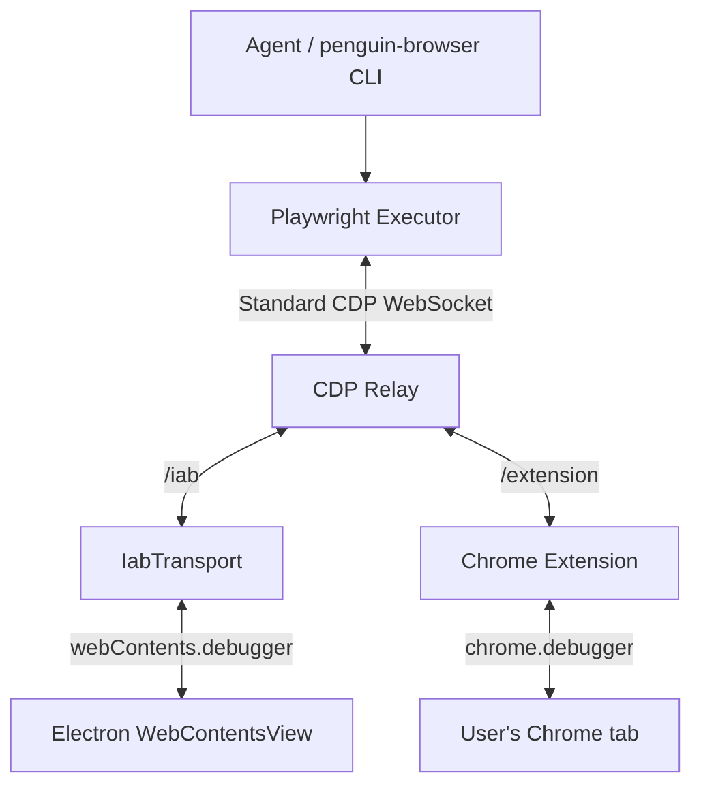

# travel-agent

Glue between [PenguinHarness](https://github.com/Prism-Shadow/penguin-harness) (agent engine) and penguin-browser (the visible in-app browser plus an optional connection to the user's own Chrome). Ctrip is a demo scene, not the product.

A user says one sentence. The agent searches, reduces the option space to a few representatives with a reason each, waits for a click that is also authorization, then fills the form and stops on the payment page. It does **not** do price watching, auto rebooking, ticket-sniping, or anything that needs a long-lived process.

Architecture, as built: [docs/architecture/iab-in-app-browser.md](docs/architecture/iab-in-app-browser.md).

## Status

This repo is a **hard fork** of PenguinHarness `0.2.2` (`d14be6f`). We do not merge that upstream. The engine stays; the downstream identity does not.

| Milestone | Meaning | State |
| --- | --- | --- |
| M0 | Browser stack in-tree, Ctrip hotel page loads | done |
| M1 | Human handoff (`requestHelp`) | done |
| M2 | Transaction-layer experiment | retired; active responsibilities moved to their consumers |
| M4 | Tab ownership | done; cross-site offer alignment dropped (see below) |

The open milestones that used to follow (M3, the one-sentence acceptance run; M5, flights)
were withdrawn on 2026-08-18. On 2026-08-19 the product UI was formally unfrozen: the engine
baseline remains pinned, while the web and desktop experience now evolves as travel-agent's own
consumer product surface, informed by the Mindtrip research snapshot
([docs/research/mindtrip.md](docs/research/mindtrip.md)).

`@travel-agent/domain` has been **removed**. It held three things. Two of them — choosing which
options to show, and deciding whether two listings are the same product — were judgements a model
makes better than a hand-maintained rule table, and had sat with no caller through six phases; they
were deleted rather than kept. The third, `submitBooking`, briefly moved into the transaction
experiment described below.

The later `@travel-agent/transaction` package has also been retired. Its only live responsibilities
were not one cohesive transaction abstraction: the interaction-card contract now belongs to the
server API, and browser handover belongs to `penguin-browser`. Its checkpoint, escalation adapter,
WAL, commitment, capability, and payment-execution chain had no reachable production reader or
executor. The invariant that does matter even when the agent is wrong remains at the real action
surface: `penguin-browser` unconditionally blocks payment controls, so the person completes payment.

## Layout

| Package | Role |
| --- | --- |
| `packages/core`, `server` | PenguinHarness engine baseline (pinned snapshot) |
| `packages/web` | travel-agent's active consumer UI, shared by web and desktop |
| `packages/browser-cli`, `browser-extension` | penguin-browser, vendored in |
| `packages/skills/skills/penguin-browser` | How the agent follows the conversation's browser choice |

## Browser backends

The Desktop offers both backends in the right-side Browser menu:

- **In-app browser (default):** every new conversation starts here. It is visible in the app and
  keeps its own persistent cookies and sign-ins.
- **My own Chrome (extension):** choose this between tasks to reuse a Chrome profile. If the bundled
  extension is not connected, the app opens setup. Selecting Chrome permits the agent to create its
  own task tabs; using an already-open Chrome tab still requires clicking the extension icon on that
  tab.

Both backends converge on the same relay and Playwright execution layer; they differ in the debugger
bridge and the browser profile being controlled:



The choice is stored per conversation and cannot change while a task runs. Opening the current page
in the system default browser does not switch the agent backend. There is no silent fallback between
the two profiles when the selected backend is unavailable.

## Development

Needs Node >= 24 and pnpm 11.

```bash
pnpm install && pnpm build
pnpm dev                 # server + web; data root ~/.penguin/dev-data
```

Dev data is separate from an installed PenguinHarness's `~/.penguin/data`.

Existing `default_agent` instances created before `penguin-browser` was added pick the skill up on the next load. Start a **new** chat after pulling — the system prompt is assembled when the session is created.

The `penguin-browser` CLI must be on `PATH` (`pnpm build` links it). The bundled Skill resolves the
in-tree CLI and uses automatic backend routing, so agent commands honor the Browser menu.

## What this is not

- Not a Ctrip / Fliggy client.
- Not a fork we intend to send back to PenguinHarness as a product.
- Not signed desktop builds of PenguinHarness (those live upstream).
