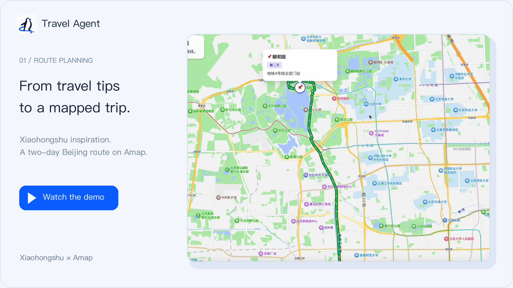
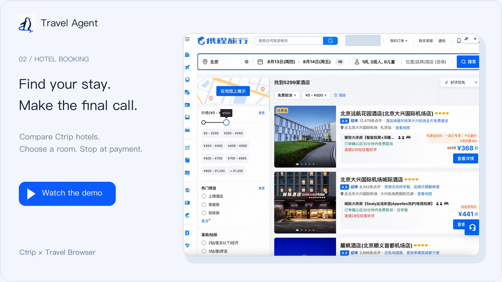
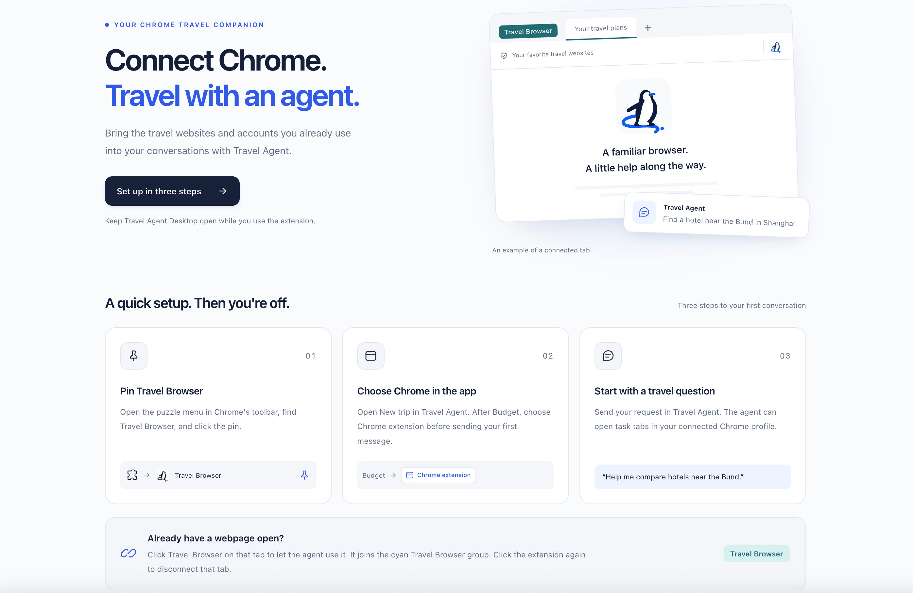

<p align="center">
  
</p>

<h1 align="center">Travel Agent</h1>

<p align="center">
  <strong>An open-source travel agent that works on real websites.</strong>
</p>

<p align="center">
  <a href="#a-browser-beside-your-conversation">See the app</a> ·
  <a href="#download">Download</a> ·
  <a href="#quickstart">Run from source</a> ·
  <a href="#travel-browser-extension">Chrome extension</a> ·
  <a href="docs/architecture/README.md">Documentation</a> ·
  <a href="#contributing">Contribute</a>
</p>

<p align="center">
  <a href="https://github.com/Prism-Shadow/travel-agent/releases/latest"></a>
  &nbsp;
  <a href="LICENSE"></a>
  &nbsp; English · <a href="README.zh.md">简体中文</a>
</p>

## A browser beside your conversation

Travel Agent is a **desktop travel assistant**. Describe what you need, then follow the agent as
it navigates travel websites, reads pages and fills forms. The conversation and the browser are
part of the same workflow.

<p align="center">
  
</p>

<p align="center"><sub>Booking flights on Ctrip with Travel Agent: describe your trip in one message and follow the agent as it searches for flights in the browser beside your conversation.</sub></p>

> “I'm travelling from Beijing to Shanghai for work tomorrow. Help me book the cheapest flight on Ctrip, without extra service packages.”

### Two ways to browse

| | In-app browser · default | Your Google Chrome · optional |
| --- | --- | --- |
| Where the page opens | Beside the conversation in the desktop app | In your own Chrome window |
| Browser profile | The app's own browser profile | Your Chrome profile, including its website sign-ins |
| Setup | Included with the desktop app | Load the Chrome extension, then choose it in the app |
| Best fit | Work and watch the page in one window | Work with websites you already use in Chrome |

**Both modes start in Travel Agent Desktop.** The extension connects the agent to your Chrome;
keep the desktop app running. Choose a browser for each conversation before starting a task.

### From a question to a trip

**New trip** opens a conversation without an upfront form. Explore an idea, ask the agent to work
on a webpage, then choose **Add to trip** when you want to organize it. Discuss accommodation,
transport and daily plans in separate chats within the same trip: destination, dates, travellers,
budget and shared notes carry across them, while conversation histories stay separate.
Useful conversations can also be kept in **Saved**.

### Task demos

**01 · From Xiaohongshu tips to an Amap itinerary**

[](https://github.com/user-attachments/assets/ca3aa959-d8ee-4ae0-ad20-740afac84a32)

Read travel posts, organize the stops into a two-day plan, then open the generated map link.
[Watch the video · 38 seconds](https://github.com/user-attachments/assets/ca3aa959-d8ee-4ae0-ad20-740afac84a32).

**02 · Find a hotel on Ctrip, then stop at payment**

[](https://github.com/user-attachments/assets/25550205-88a4-4e31-8fff-03fea801fe69)

Compare hotels and room options, confirm a choice, then review the booking form. The user makes
the final payment. [Watch the video · 76 seconds](https://github.com/user-attachments/assets/25550205-88a4-4e31-8fff-03fea801fe69).

## Download

**Desktop app · macOS, Windows and Linux · Bring your own model API key**

The links below always point at the [latest release](https://github.com/Prism-Shadow/travel-agent/releases/latest);
`SHA256SUMS` there covers every installer.

| Platform | Download |
| --- | --- |
| macOS (Apple Silicon) | [travel-agent-darwin-arm64.dmg](https://github.com/Prism-Shadow/travel-agent/releases/latest/download/travel-agent-darwin-arm64.dmg) |
| macOS (Intel) | [travel-agent-darwin-x64.dmg](https://github.com/Prism-Shadow/travel-agent/releases/latest/download/travel-agent-darwin-x64.dmg) |
| Windows (x64) | [travel-agent-win32-x64.exe](https://github.com/Prism-Shadow/travel-agent/releases/latest/download/travel-agent-win32-x64.exe) |
| Linux (AppImage) | [travel-agent-linux-x86_64.AppImage](https://github.com/Prism-Shadow/travel-agent/releases/latest/download/travel-agent-linux-x86_64.AppImage) |
| Linux (Debian / Ubuntu) | [travel-agent-linux-amd64.deb](https://github.com/Prism-Shadow/travel-agent/releases/latest/download/travel-agent-linux-amd64.deb) |

**The builds are not code-signed yet**, so both desktop platforms warn on first launch:

- **macOS** refuses to open the app at first ("Apple could not verify…"). Open **System Settings →
  Privacy & Security**, find the message about Travel Agent and choose **Open Anyway** — or run
  `xattr -cr "/Applications/Travel Agent.app"` once in Terminal.
- **Windows** shows a SmartScreen warning. Choose **More info → Run anyway**.
- **Linux** needs no bypass: `chmod +x` the AppImage, or
  `sudo apt install ./travel-agent-linux-amd64.deb`.

The app window signs in automatically. If you ever meet the sign-in page, every new installation
starts as **`traveler` / `traveler-2026`** — change the password after your first sign-in. Then
follow steps 1–4 under [Quickstart](#quickstart): the app needs your model API key before its
first conversation. Installed-app data lives in `~/.penguin/data`.

## Quickstart

**Development preview · Run from source · Bring your own model API key**

Install **Node.js 24+** and **pnpm 11**, then run:

```bash
git clone https://github.com/Prism-Shadow/travel-agent.git
cd travel-agent
pnpm install
pnpm desktop
```

This builds the workspace and opens the desktop app with its embedded server and browser.
The app window signs in automatically; the sign-in page (for example `pnpm dev` in a browser)
takes the same initial credentials as an installed app, **`traveler` / `traveler-2026`**.

1. Open **Models** and add your model provider's API key.
2. Choose **New trip**. New conversations use the **in-app browser** by default.
3. Ask the agent to open a travel page and help you explore it. Follow the webpage beside the chat.
4. Choose **Add to trip** when you want to keep related conversations and plans together.

Source-run data lives in `~/.penguin/dev-data`, separate from an installed app's `~/.penguin/data`.
You can also configure `ANTHROPIC_API_KEY` or `DEEPSEEK_API_KEY` in a local `.env` file copied from
[.env.example](.env.example).

## Travel Browser extension

**Use your own Chrome, with the travel websites and accounts you already know.** Travel Browser
connects Travel Agent to your Chrome profile so you can work with your existing website sign-ins.
Keep **Travel Agent Desktop running** while you use the extension.

<p align="center">
  
</p>

<p align="center"><sub>The extension's welcome guide. The browser illustration shows an example connected tab.</sub></p>

### Install in Chrome

The extension is included in this repository and is currently loaded from source. The desktop
command in [Quickstart](#quickstart) builds it along with the app.

1. In Chrome, open `chrome://extensions` and enable **Developer mode**.
2. Choose **Load unpacked**, then select `packages/browser-extension/dist` inside your checkout.
   Chrome lists the extension as **Travel Browser**.
3. Open Chrome's puzzle menu and pin **Travel Browser** to the toolbar.

Desktop connects automatically and remembers the pairing across restarts. If multiple apps are
running, use **Connection** on the extension welcome page to choose one. After updating, restart
Desktop and reload the extension; Chrome may ask you to enable its local connection permission.

### Start a travel task

1. Open **New trip** in Travel Agent Desktop. Use the browser button after **Budget** to select
   **Chrome extension** before your first message.
2. Send a request, such as “Help me compare hotels near the Bund in Shanghai.” The agent can open
   task tabs in your connected Chrome profile.

For an existing chat, choose **My own Chrome (extension)** in the **Browser** panel's **⋮** menu
between tasks. New chats use the in-app browser by default.

**Already have a webpage open?** Click the Travel Browser icon on that tab to authorize the agent
to use it. The tab joins the cyan **Travel Browser** group. Click the icon again to disconnect
that tab.

After rebuilding the extension, click **Reload** on its card in `chrome://extensions`.
See the [extension guide](packages/browser-extension/README.md#getting-started) for more detail.

## Your choices, your data

- **You decide at payment.** The booking workflow is designed around options with reasons,
  your explicit selection, form filling and a stop at payment. Browser payment controls are
  blocked by an unconditional gate. Complete booking-flow validation is ongoing; see the
  [acceptance plan](tasks/todo.md#t01--establish-complete-travel-task-acceptance).
- **Browser choice stays explicit.** It is saved per conversation, stays fixed during a run and
  never silently switches when unavailable. Choosing Chrome and authorizing an existing tab are
  separate actions.
- **Your trip files stay on your disk.** Model requests go to your configured provider, and browser
  tasks contact the websites they visit. Local storage does not mean offline processing. Advanced
  secret-entry capabilities remain gated pending the
  [runtime isolation decision](docs/decisions/proposed/2026-08-16-agent-runtime-isolation.md).

## Contributing

The active UI is shared by web and desktop. For UI development with Vite, see the
[web development guide](packages/web/README.md); use the desktop app to work on and validate the
complete browser-control experience. The main pieces are:

| Layer | Packages |
| --- | --- |
| Product UI | `packages/web` |
| Desktop and visible browser | `packages/desktop` |
| Agent runtime and application API | `packages/core`, `packages/server` |
| Browser control and Chrome bridge | `packages/browser-cli`, `packages/browser-extension` |
| Built-in skills | `packages/skills` |

Start with the [architecture](docs/architecture/README.md), [development plan](tasks/todo.md) or
[known issues](docs/issues/). Keep changes focused and update the owning spec when behavior changes.

```bash
pnpm typecheck
pnpm test
pnpm format:check
```

## Built on

Travel Agent is built on [PenguinHarness](https://github.com/Prism-Shadow/penguin-harness).

## License

[Apache License 2.0](LICENSE).
