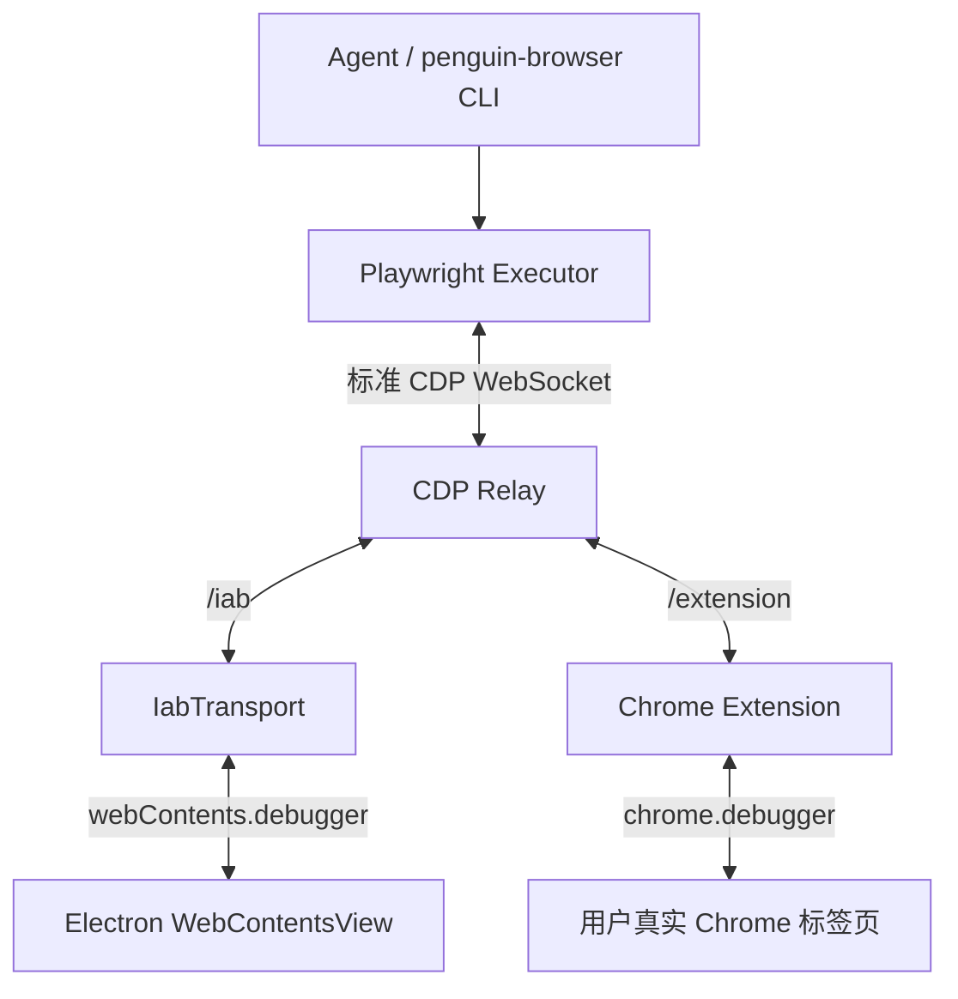

# travel-agent

把 [PenguinHarness](https://github.com/Prism-Shadow/penguin-harness)（agent 引擎）和 penguin-browser（右侧应用内浏览器，以及可选的用户 Chrome）粘起来。携程是演示场景，不是产品。

用户说一句话。agent 去搜，把选项空间收到几个带理由的代表，等一次同时等于授权的点击，然后填单，停在支付页。**不做**降价监控、自动改签、抢票，以及任何需要长期驻留的事。

架构现状见 [docs/architecture/iab-in-app-browser.md](docs/architecture/iab-in-app-browser.md)。

## 现状

本仓是 PenguinHarness `0.2.2`（`d14be6f`）的**硬分叉**。不再 merge 上游。引擎留下，下游身份去掉。

| 里程碑 | 含义 | 状态 |
| --- | --- | --- |
| M0 | 浏览器栈进仓，携程酒店页能开 | 完成 |
| M1 | 人机移交（`requestHelp`） | 完成 |
| M2 | 事务层实验 | 已退役；仍在使用的职责已归还各消费端 |
| M4 | tab 归属 | 完成；跨站方案对齐已废弃（见下） |

原先排在后面的开放里程碑（M3 一句话验收闭环、M5 机票）已于 2026-08-18 撤出规划。2026-08-19
正式解冻产品 UI：引擎基线继续锁定，web 与 desktop 界面则作为 travel-agent 自己的消费级产品面持续演进。
方向参考 Mindtrip 调研快照（[docs/research/mindtrip.md](docs/research/mindtrip.md)）。

`@travel-agent/domain` 已**删除**。它原本装三样东西。其中两样——挑哪几个选项给人看、判断两条列表是不是
同一个商品——是模型比手工维护的规则表做得更好的**判断**，而且连着六个 Phase 没有任何调用方，所以直接删掉
而不是继续维护。第三样 `submitBooking` 曾短暂移入下面所说的事务层实验。

后来的 `@travel-agent/transaction` 包也已经退役。它仍在使用的职责并不构成一个内聚的「事务层」：交互卡片
契约现在归 server API，浏览器移交状态归 `penguin-browser`。没有生产读者或可达执行器的检查点、升级适配器、
WAL、承诺、能力令牌和代付链全部删除。真正需要在 agent 出错时仍然成立的约束留在真实动作入口：
`penguin-browser` 无条件拦截付款控件，最后由用户亲自完成支付。

## 目录

| 包 | 职责 |
| --- | --- |
| `packages/core`、`server` | PenguinHarness 引擎基线（锁定快照） |
| `packages/web` | travel-agent 持续演进的消费级界面，web / desktop 共用 |
| `packages/browser-cli`、`browser-extension` | 并入的 penguin-browser |
| `packages/skills/skills/penguin-browser` | 教 agent 遵循当前对话的浏览器选择 |

## 浏览器后端

Desktop 右侧 Browser 菜单正式提供两种后端：

- **应用内浏览器（默认）：** 每个新对话都从这里开始。页面在应用内可见，并保留独立的 Cookie 与登录状态。
- **我自己的 Chrome（扩展）：** 在任务之间选择它，可复用 Chrome 配置文件。扩展未连接时会直接打开安装引导。选择 Chrome 允许 agent 创建任务自己的标签页；若要使用 Chrome 中已经打开的标签页，用户仍需在该页点击扩展图标。

两个后端最终汇合到同一套 Relay 与 Playwright 执行层；区别在于 debugger 桥接方式和被控制的浏览器 profile：



选择按对话保存，任务运行时不能切换。在系统默认浏览器中打开当前页面不等于切换 agent 后端。所选后端不可用时不会静默切到另一套登录环境。

## 开发

需要 Node >= 24、pnpm 11。

```bash
pnpm install && pnpm build
pnpm dev                 # server + web；数据在 ~/.penguin/dev-data
```

开发数据和已安装的 PenguinHarness 用的 `~/.penguin/data` 是分开的。

在加入 `penguin-browser` 之前创建的 `default_agent`，下次加载会补上这个 skill。拉代码后请**开一个新对话**——系统提示在创建 session 时组装。

`penguin-browser` CLI 需要在 `PATH` 上（`pnpm build` 会 link）。内置 Skill 会解析本仓 CLI，并使用自动后端路由，确保 agent 遵循 Browser 菜单。

## 这不是什么

- 不是携程 / 飞猪客户端。
- 不是准备作为产品回赠给 PenguinHarness 的 fork。
- 不是 PenguinHarness 的签名桌面安装包（那在上游）。
