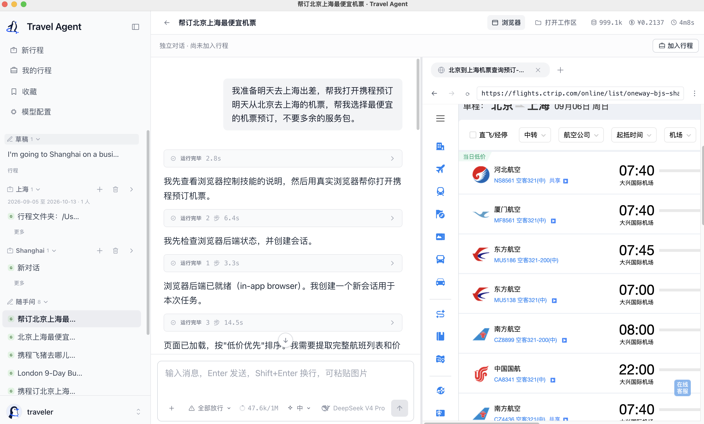
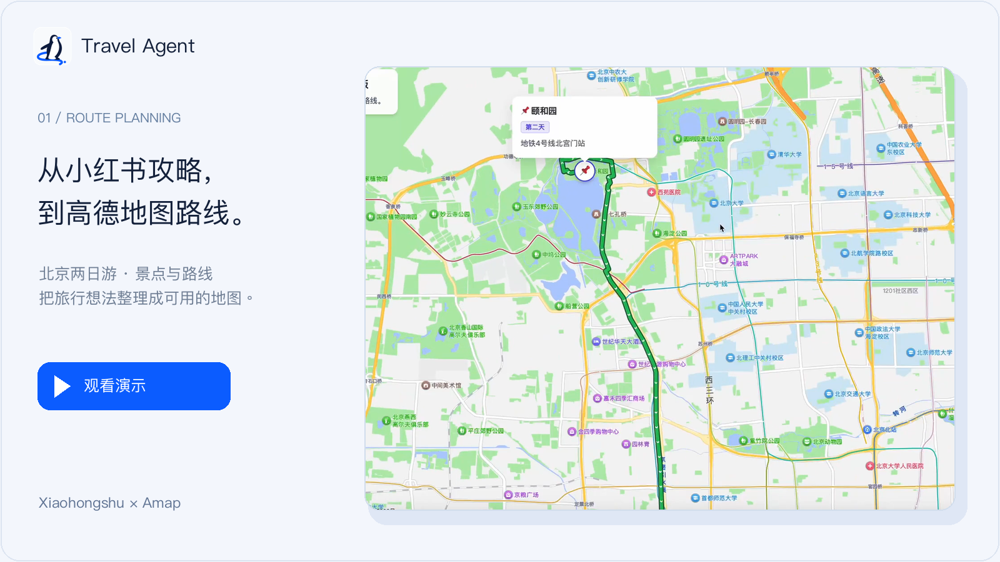
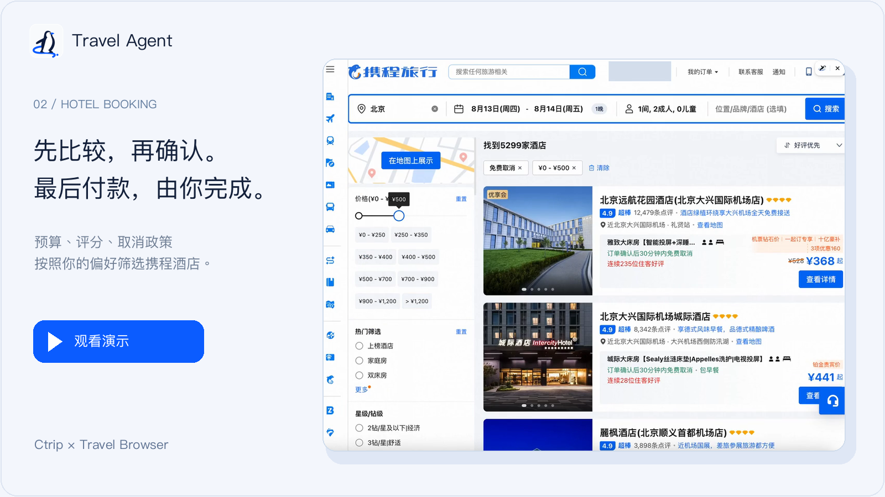
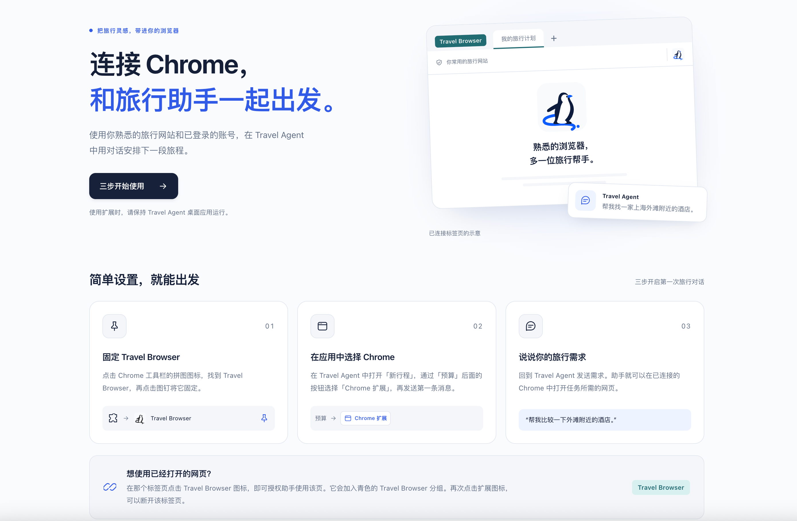

<p align="center">
  
</p>

<h1 align="center">Travel Agent</h1>

<p align="center">
  <strong>会操作浏览器的开源 AI 旅行助手</strong>
</p>

<p align="center">
  <a href="#对话旁边就是真实的浏览器">看看界面</a> ·
  <a href="#快速开始">快速开始</a> ·
  <a href="#travel-browser-浏览器扩展">Chrome 扩展</a> ·
  <a href="docs/architecture/README.md">项目文档</a> ·
  <a href="#参与开发">参与开发</a>
</p>

<p align="center">
  <a href="LICENSE"></a>
  &nbsp; <a href="README.md">English</a> · 简体中文
</p>

## 对话旁边，就是真实的浏览器

Travel Agent 是一个**桌面旅行助手**。说出需求后，Agent 可以打开旅行网站、阅读页面、填写表单，
你可以看到它正在操作的网页。对话和浏览器共同推进同一个任务。

<p align="center">
  
</p>

<p align="center"><sub>通过 Travel Agent 在携程预订机票：用一句话说出出行需求，在对话旁跟随助手查询航班、推进预订。</sub></p>

> “明天从北京去上海出差，帮我在携程预订最便宜的机票，不要多余的服务包。”

### 两种浏览器使用方式

| | 桌面内置浏览器 · 默认 | 自己的 Google Chrome · 可选 |
| --- | --- | --- |
| 网页在哪里 | 桌面应用内，与对话并排显示 | 你自己的 Chrome 窗口中 |
| 使用哪个环境 | 应用独立的浏览器环境 | 你的 Chrome 环境，可复用网站登录状态 |
| 如何启用 | 启动桌面应用即可使用 | 加载 Chrome 扩展，再在应用内选择 |
| 适合什么情况 | 在同一个窗口里讨论、查看网页和推进任务 | 在日常使用的 Chrome 中处理已登录的网站 |

**两种方式都从 Travel Agent 桌面端发起。** 扩展负责连接你自己的 Chrome，使用时保持桌面应用运行。
每段对话可以选择自己的浏览器，在开始任务前选好即可。

### 从一个问题，慢慢整理成一段行程

点击**新行程**就能开始对话，无需先填完整表单。可以先聊想法、让 Agent 操作网页，再选择**加入行程**。
住宿、交通和每日计划可以在同一行程中分开聊：目的地、日期、同行人、预算和共享备注会带入这些对话，
各自的聊天记录保持独立。有价值的讨论也可以放进**收藏**，以后继续。

### 任务演示

**01 · 从小红书攻略，到高德地图路线**

[](https://github.com/user-attachments/assets/ca3aa959-d8ee-4ae0-ad20-740afac84a32)

阅读旅行攻略，把景点与游玩顺序整理成两日计划，再打开生成的地图链接。
[观看视频 · 38 秒](https://github.com/user-attachments/assets/ca3aa959-d8ee-4ae0-ad20-740afac84a32)。

**02 · 按条件找酒店，确认后停在支付页**

[](https://github.com/user-attachments/assets/25550205-88a4-4e31-8fff-03fea801fe69)

比较酒店与房型，确认自己的选择，再查看预订表单；最后付款由你完成。
[观看视频 · 76 秒](https://github.com/user-attachments/assets/25550205-88a4-4e31-8fff-03fea801fe69)。

## 快速开始

**开发预览版 · 从源码运行 · 使用自己的模型 API key**

准备好 **Node.js 24+** 和 **pnpm 11**，然后执行：

```bash
git clone https://github.com/Prism-Shadow/travel-agent.git
cd travel-agent
pnpm install
pnpm desktop
```

命令会构建工作区并打开桌面应用，同时启动内置服务和浏览器。应用窗口会自动登录。如果看到登录页
（例如在浏览器里使用 `pnpm dev`），每个新安装的初始账号都是 **`traveler` / `traveler-2026`**，
首次登录后请修改密码。

1. 打开**模型配置（Models）**，填写模型服务商的 API key。
2. 点击**新行程**。新对话默认使用**应用内浏览器**。
3. 请 Agent 打开一个旅行网页并协助查看，在对话旁跟随网页上的进展。
4. 想把相关讨论和计划整理在一起时，选择**加入行程**。

源码运行的数据保存在 `~/.penguin/dev-data`，与安装版应用的 `~/.penguin/data` 分开。
也可以把 [.env.example](.env.example) 复制为本地 `.env` 文件，配置
`ANTHROPIC_API_KEY` 或 `DEEPSEEK_API_KEY`。

## Travel Browser 浏览器扩展

**在熟悉的 Chrome 中，使用你常用的旅行网站和已登录的账号。** Travel Browser 将 Travel Agent
连接到你自己的 Chrome，方便延续网站上的登录状态。使用扩展时，请保持 **Travel Agent 桌面应用运行**。

<p align="center">
  
</p>

<p align="center"><sub>扩展欢迎页与使用指引，右上方为已连接标签页的示意。</sub></p>

### 安装到 Chrome

扩展已包含在仓库中，目前通过源码加载。[快速开始](#快速开始)中的桌面启动命令会同时构建扩展。

1. 在 Chrome 中打开 `chrome://extensions`，启用**开发者模式**。
2. 点击**加载已解压的扩展程序**，选择仓库中的 `packages/browser-extension/dist` 目录。
   Chrome 中的扩展名称为 **Travel Browser**。
3. 打开 Chrome 工具栏的拼图菜单，将 **Travel Browser** 固定到工具栏。

桌面应用会自动连接，配对关系在重启后仍会保留。同时运行多个应用时，可在扩展欢迎页的
**连接设置**中选择。更新后请重启桌面应用并重新加载扩展；Chrome 若提示本地连接权限，请启用扩展。

### 开始一次旅行任务

1. 在 Travel Agent 桌面应用中点击**新行程**，通过**预算**后面的浏览器按钮选择 **Chrome 扩展**，
   再发送第一条消息。
2. 说出需求，例如「帮我比较一下上海外滩附近的酒店」。Agent 可以在已连接的 Chrome 中打开任务所需的标签页。

已有对话可以在任务未运行时，通过**浏览器（Browser）**面板的 **⋮** 菜单选择**我自己的 Chrome（扩展）**。
新对话仍默认使用应用内浏览器。

**想使用已经打开的网页？** 在那个标签页点击 Travel Browser 图标，即可授权 Agent 使用该页。
它会加入青色的 **Travel Browser** 分组；再次点击扩展图标，可以断开该标签页。

重新构建扩展后，在 `chrome://extensions` 中点击扩展卡片上的**重新加载**。
更多说明见[扩展使用文档](packages/browser-extension/README.md#getting-started)。

## 选择与数据，由你掌握

- **最后的支付由你完成。** 预订流程围绕带理由的选项、你的明确选择、填写表单和停在支付页设计。
  浏览器付款控件受到无条件支付关卡拦截。完整预订流程仍在验证中，详见
  [验收计划](tasks/todo.md#t01--establish-complete-travel-task-acceptance)。
- **浏览器选择始终明确。** 选择按对话保存，任务运行中不能切换；不可用时不会静默切到另一种浏览器。
  选择 Chrome 和授权使用已有标签页，是两个独立的动作。
- **行程文件保存在本地。** 模型请求发送给你配置的服务商，浏览器任务会访问相应网站。
  本地存储不等于离线处理。高级敏感信息填写能力仍受门控限制，等待
  [运行时隔离方案](docs/decisions/proposed/2026-08-16-agent-runtime-isolation.md)落定。

## 参与开发

Web 和桌面端共用同一套产品界面。使用 Vite 调试界面，请查看 [Web 开发文档](packages/web/README.md)；
开发和验证完整的浏览器控制体验，请运行桌面端。主要模块如下：

| 层次 | 包 |
| --- | --- |
| 产品界面 | `packages/web` |
| 桌面应用与可见浏览器 | `packages/desktop` |
| Agent 运行时与应用 API | `packages/core`、`packages/server` |
| 浏览器控制与 Chrome 桥接 | `packages/browser-cli`、`packages/browser-extension` |
| 内置技能 | `packages/skills` |

可以从[系统架构](docs/architecture/README.md)、[开发计划](tasks/todo.md)或[已知问题](docs/issues/)开始。
保持改动范围集中，行为变化时同步更新相应规格。

```bash
pnpm typecheck
pnpm test
pnpm format:check
```

## 构建基础

Travel Agent 基于 [PenguinHarness](https://github.com/Prism-Shadow/penguin-harness) 构建。

## 许可证

[Apache License 2.0](LICENSE)。
