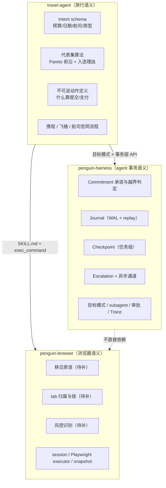
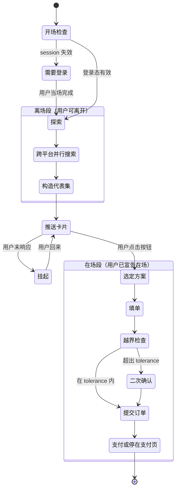

# Travel Agent 架构设计

| | |
| --- | --- |
| 状态 | 硬分叉（不再 merge penguin-harness）；M0–M2 库已验证；M3 闭环未完成 |
| 日期 | 2026-08-12 |
| 基线 | penguin-harness `d14be6f` (0.2.2) · penguin-browser `ba9e13b` |
| 最近更新 | 2026-08-13 |

---

## 1. 项目定位

**travel-agent 是把 penguin-harness 与 penguin-browser 的能力整合起来的项目。** 前者提供 agent 执行引擎（ReAct 循环、技能、记忆、目标模式），后者提供浏览器控制（session、CDP relay、Playwright executor）。整合点就是本项目的产出。

**携程只是一个演示场景，与任何具体平台无关。** 它被选作演示是因为订票同时压满了这套整合要处理的每一类难题：需要真实登录态、有不可逆的花钱动作、有验证码这类只能交给人的步骤、选项空间大到必须替用户收敛。任何一个具备这些性质的场景都同样适用。

这条定位有一个直接的工程后果：**任何"只对某个平台/某种语言/某个国家成立"的规则都不该写进代码。** 本文档记录了两次违反它的返工——一次是准备为携程写声明式配方（§7.5），一次是在方案对齐里硬编了中文酒店命名语法（§7.7）。判据在 §2.5。

演示场景的形态：用户说一句话，agent 跑一次，交付一个待确认的方案或一个订单。**不做**的是时间维度（降价监控、余票监控、自动改签）——那需要长期驻留任务、跨会话状态持久化和监控触发器，是复杂度与故障率的主要来源，而它们不增加整合本身的说服力。

**非目标：** 抢票、秒杀、绕过任何平台的风控。演示使用用户自己的账号完成用户自己的订单，不做匿名爬取。

---

## 2. 核心设计判断

以下四条是整个架构的地基，每一条都直接决定了后面的结构。

### 2.1 偏好是构造出来的，不是取出来的

人的偏好不是取出来的，是在看到选项的过程中构造出来的。问"机票预算多少"答不上来，因为不知道这条线现在卖多少钱；看到 880 和 1580 两个选项，才知道自己愿意为省两小时付多少。

**推论一：授权不是抽象边界，是对具体方案的承诺。**

用户选中「东航 MU5137，14:20 起飞，1280」这个动作本身就是授权。越界的判定随之从"是否超过阈值"变成"**实际要执行的，与用户确认过的那个方案是否一致**"——比较两个结构化对象，比判断阈值既严格又好实现。

价格漂移在**具体语境里**问：呈现方案时附一句"如果下单时涨价，多少以内我自己决定"。抽象地问容差没人答得上来，指着一个 1280 的具体航班问，用户能答。

**推论二：呈现质量就是产品本身。**

倒 50 条航班给用户等于什么都没做。真正有用的是从选项空间里选出 3–4 个**代表**，张开权衡维度。这需要识别 tradeoff 维度、求 Pareto 前沿、挑代表点——这是 travel-agent 的核心，比浏览器控制重要得多。浏览器控制是可替换的基础设施，"把选项空间讲清楚"才是壁垒。

### 2.2 有时效的介入，在用户不在场时无解

验证码有时效（通常 60–120 秒），短信 OTP 更短。而"人工接管平均 15–20 秒完成"这个业界数据，是**在用户已经盯着屏幕的前提下**测的。用户在开会，推送到手机、解锁、切应用、找到页面——早超时了。

调研结论（详见 §10）：**没有任何产品解决了"用户不在场 + 有时效介入"这个组合。** 所有方案要么假设无时效（审批可以等两小时），要么假设人在场（takeover 模式）。

**推论：解法不是更好的通道，是重排任务时序。**

| 阶段 | 内容 | 是否触发验证 |
| --- | --- | --- |
| **离场段** | 搜索、跨平台比价、构造代表集 | 纯只读浏览，不触发 |
| **在场段** | 登录（如需）、填单、下单、支付 | 必然触发，但用户就在 |

硬规则：**agent 在用户离开期间，绝不尝试任何会触发验证的动作。**

配套：**开场在场检查**——任务启动时立即验证登录态是否有效、是否需要预先验证。有问题当场解决，趁用户还没走。绝不能跑到一半才发现 session 过期。

这样"验证码超时"从一个无解问题变成了不发生的问题。移交机制仍然要做（会话中途失效确实会发生），但定位是**异常兜底**，不是核心机制。

### 2.3 恢复必须是 replay 语义，不是 checkpoint 语义

LangGraph 一类的 checkpoint 方案，恢复时**整个节点从头重跑**，要求开发者自己保证幂等。业界对这一派的批评是三条硬伤：没有故障检测（进程崩了没人知道）、恢复要手动、以及**两个进程同时恢复同一个 thread 时没有内建协调**。

对订票场景这是致命的：一旦"提交订单"落在恢复点之前，就是重复下单，真金白银。

**推论：不可逆动作走 write-ahead 日志，恢复走 replay。**

动作前落盘 `{seq, kind: "intent", action, params}`，完成后落盘 `{seq, kind: "result", outcome}`。恢复时扫描日志：

- 有 intent 有 result → 返回记录的结果，**不重新执行**
- 有 intent 无 result → **唯一正确动作是去查询订单状态**，绝不重试

### 2.5 什么该是代码，什么该交给 agent

判据一条：**机械可判定的归代码，需要判断的归 agent。**

| 归代码 | 归 agent |
| --- | --- |
| WAL 落盘与 replay 语义 | 这两条listing 是不是同一个产品 |
| Pareto 前沿（纯数学） | 页面上哪个字段是目的地 |
| 点击重试、遮挡穿透、actionability 兜底 | 这个页面此刻在说什么 |
| 授权阶梯、漂移比对、同平台不合并 | 值不值得为省 300 多飞两小时 |

左列的共同点是**换个平台、换种语言、换个品类都不变**，而且模型做它们又慢又容易错。右列的共同点是**依赖具体语境**，硬编就意味着为每个平台维护一份必然过期的规则。

反过来的两条纪律：
- 代码里出现任何语言词表、站点选择器、国别规则，都是把右列的东西写进了左列——这是本项目返工过两次的错误。
- 但**安全规则不能因为"交给 agent 更灵活"就下放**。「同一平台的两条永不合并」这类规则，adjudicator 从外部根本看不见依据，必须由代码强制。

### 2.4 职责判据与仓库边界是两个问题

**职责判据只有一条：这个能力的语义依赖什么？**

- 依赖"浏览器"→ 浏览器层
- 依赖"agent 执行事务"→ 事务层
- 依赖"旅行"→ 领域层

这条判据决定的是**代码按什么语义组织、放在哪个目录**，它不决定仓库边界。

**仓库边界由另一个问题决定：那一层有没有真实的上游？**

有真实上游（有别的消费者、在持续演进）就保持同步，没有就并进来。两个问题分开回答，才不会出现"为了维持一个不存在的上游而多维护一个仓库"。具体结论见 §3。

---

## 3. 架构与仓库策略

下面这张图是**语义分层**，不是仓库划分——物理上只维护 travel-agent 一个仓库。



### 关键接口约束

**penguin-harness 不应该知道 penguin-browser 存在。**

它只提供事务语义（承诺、日志、检查点、升级）；penguin-browser 只提供浏览器控制；**travel-agent 是唯一把两者粘起来的地方**。

Escalation 的 payload 里带截图路径，但事务层只管传输，不管这个路径是谁生成的。保持这条约束，三层才能各自独立演进——即使它们现在住在同一个仓库里，边界也不该塌掉。

### 仓库策略：硬分叉（2026-08-13 更正）

初版把 penguin-harness 留作只读 upstream、定期 merge，把 landing/docs 留在树上以免 delete/modify 冲突。那是一份**从未行使的期权**：remote 没有配过 `upstream`，日常 100% 在本仓改，保费却写进每个决定（不能改 README 身份、改一行提示词要走 kernel 哈希、新预装 skill 进不了旧 agent）。

**2026-08-13 起不再 merge penguin-harness。** 引擎冻结在基线 `d14be6f`（0.2.2）加上本仓的补丁。需要上游某一刀时再 cherry-pick，不为「永远可 merge」约束仓库形状。

| 项目 | 处置 |
| --- | --- |
| **travel-agent** | 唯一维护的仓库 |
| **penguin-harness** | 硬分叉来源，不当下游。不配 upstream remote，不定期 merge |
| **penguin-browser** | 已并入，原仓库不再维护 |

分层纪律还在，理由从「merge 便宜」改回「语义边界」：

1. **新能力走新 package**——旅行语义、浏览器层、事务层各过各的，不把旅行写进 `packages/core`。
2. **事务层继续是 `packages/transaction`**——不进 core。将来若要回赠上游，搬一个目录。
3. ~~**landing / docs 不再为 merge 留着。**~~ —— **已执行**（2026-08-17）：两处引用都已不成立并被拆除。`scripts/test-installer.sh` 里测的是 `packages/landing/public/install.sh`，那是 penguin.ooo 的薄转发器，而本仓不运营那个域名；desktop 的 `render-icon.mjs` 并不读 landing 的内容（SVG 来自 `packages/web/public/`），只是借 landing 的 `package.json` 解析 `@playwright/test`——而 landing 被 workspace 排除、`node_modules` 从未安装，那个脚本早已跑不动，产物 `build/icon*.png` 也已提交。两个目录、`pages.yml`、`scripts/build-site.mjs` 与 `render-icon.mjs` 一并删除，`pnpm-workspace.yaml` 的排除条目随之取消。

根目录的 `install.sh` / `install.ps1` 与 `.github/workflows/release.yml` **保留**：那是本仓自己发 CLI 用的，与 penguin.ooo 的转发器是两个东西。

### penguin-browser 的并入方式

原仓库 81M，但真正需要的只有约 5M：

| 部分 | 体积 | 并入 |
| --- | --- | --- |
| `playwright/`（整个 playwright fork） | 71M | **否** |
| `website/` | 4.1M | 否 |
| `penguin-browser/`（CLI + relay + executor） | 4.3M | 是 → `packages/browser-cli/` |
| `extension/` | 488K | 是 → `packages/browser-extension/` |
| `skills/penguin-browser/SKILL.md` | 24K | 是 → `packages/skills/skills/` |

那 71M 可以扔掉，因为它已发布在 npm：**`@xmorse/playwright-core@1.59.10`，与 vendored 版本号完全一致**；stealth 用的 `@playwriter/patchright-core@1.61.0-playwriter.1` 同样在 npm。把依赖声明从 `workspace:^` 改成 `^1.59.10` 即可，`pnpm bootstrap`（`generate_injected.js` + `build.mjs`）那一步也一并省掉。

**该前提已于 2026-08-12 验证成立**：vendored 那份与已发布的 `@xmorse/playwright-core@1.59.10` 仅有 3 处注释里的品牌名差异（"Penguin Browser" vs "Playwriter"）与 npm 发布时剥离的 `scripts` 字段，`browsers.json` 完全一致。typecheck / build / 62 个单元测试 / CDP relay 全部通过。完整记录见 `packages/browser-cli/VENDOR.md`。

并入方式是**文件拷贝 + 溯源记录**，不是 `git subtree`。早期草案写的是 subtree，查证后推翻：subtree 的价值在于 `pull` / `push` 回上游，而源仓库不再维护；且 `subtree add` 会把整仓 81M（含 71M vendored Playwright）永久写进对象库，即使随后 `git rm` 也无法回收。溯源信息记在 `VENDOR.md` 与并入提交的 message 里，比 subtree 元数据可读。

---

## 4. 数据模型

以下为设计草案，字段会在实现时调整。

### 4.1 Intent（travel-agent）

用户需求的结构化表达。**注意硬约束与软偏好必须分开**——混在一起会出现"为了满足偏好而突破预算"。

```ts
interface Intent {
  kind: "flight" | "hotel"
  /** 需求：任务的定义域 */
  demand: {
    origin?: string          // 机票
    destination: string
    dateWindow: { from: string; to: string }
    travelers: { adults: number; children?: number }
    cabinOrRoom?: string
  }
  /** 硬约束：参与过滤，违反即淘汰 */
  hardConstraints: {
    budgetCeiling?: number   // 可为空 —— 用户常常给不出
    directOnly?: boolean
    noRedEye?: boolean
    arriveBefore?: string
  }
  /** 软偏好：参与排序，不参与过滤 */
  softPreferences: {
    preferredCarriers?: string[]
    preferEarlyDeparture?: boolean
    weights?: Record<string, number>
  }
}
```

`budgetCeiling` 可以为空是刻意的：§2.1 的结论是用户在探索之前给不出这个数，硬要他给只会得到一个假数字。

### 4.2 Commitment（事务层，通用）

替代了早期设计中的抽象 `Authority`。授权 = 对一个具体方案的承诺。

```ts
interface Commitment {
  /** 用户确认的那个具体方案的结构化快照 */
  approved: Record<string, unknown>
  /** 允许的漂移范围 —— 在呈现方案时就地询问得到 */
  tolerance: {
    priceIncrease?: number       // 绝对值，单位：元
    [dimension: string]: unknown
  }
  /** 自主执行的终点 */
  ceiling: "read_only" | "fill_form" | "submit_order" | "pay"
  approvedAt: string
  /** 授权来源，用于审计 */
  channel: string
}
```

`ceiling` 默认 `fill_form`：填完单停在支付页。升到 `submit_order` / `pay` 需要用户在卡片上显式选择。

**越界判定** = `实际方案` 与 `approved` 做结构化 diff，差异超出 `tolerance` 即升级。

### 4.3 Journal（事务层，通用）

append-only，replay 语义的基础。

```ts
type JournalEntry =
  | { seq: number; kind: "intent"; action: string; params: unknown; at: string }
  | { seq: number; kind: "result"; refSeq: number; outcome: unknown; at: string }

interface Journal {
  append(entry: JournalEntry): Promise<void>
  /** 恢复时调用：返回所有「有 intent 无 result」的悬空条目 */
  danglingIntents(): Promise<JournalEntry[]>
  /** replay：已完成的动作直接返回记录结果，不重新执行 */
  replay<T>(action: string, params: unknown, exec: () => Promise<T>): Promise<T>
}
```

`replay()` 是唯一允许执行不可逆动作的入口。任何绕过它直接操作浏览器提交订单的代码路径都是 bug。

### 4.4 Checkpoint（分层）

| 层 | 内容 | 归属 |
| --- | --- | --- |
| 任务级 | 阶段、候选集、代表集、已呈现方案、用户选择 | 事务层 |
| 浏览器级 | session id、page url、Playwright `state` | 浏览器层 |

A 形态下任务级检查点的生命周期 = 会话，落在 `<agent_dir>/scratchpad/<session_id>/`，不需要长期存储。

### 4.5 Escalation（事务层，通用）

```ts
interface Escalation {
  type: "capability_gap" | "authority_gap" | "knowledge_gap"
  /** 需要人做什么 —— 用祈使句，不是描述现状 */
  ask: string
  context: {
    summary: string
    screenshotPath?: string
    options?: unknown[]
  }
  channel: string
  timeoutMs: number
  /** 超时后的默认行为 —— 缺了这个，超时等于任务静默死亡 */
  onTimeout: "suspend" | "abort" | "proceed_with_default"
}
```

`onTimeout` 默认 `suspend`：保存检查点并挂起，等用户下次回来恢复，不是失败。

注意这里**没有 `recovery_gap`**。环境变化（页面改版、超时、售罄）应当由 agent 重规划处理，不该找人——把它做成升级类型会得到一个每两分钟停一次的 agent。

---

## 5. 任务时序



**开场检查**是整个时序里最容易被省略也最不能省的一步。它把"跑到一半发现 session 过期"这个高频故障挪到了用户还在的那一刻。

**离场段内的所有动作必须是只读的。** 搜索、翻页、筛选、读取价格——这些不触发验证。任何写操作（登录、加入购物车、填表）都属于在场段。

### 实测：那堵"登录墙"其实是残缺请求（两次修正）

这一节记录了一个被推翻两次的结论，过程本身比结论有价值。

**第一版（M0，headless 匿名）**：深链接 `hotels.ctrip.com/hotels/list?city=2&checkin=…` 302 到 `passport.ctrip.com`，而频道首页 `hotels.ctrip.com/` 匿名可进。结论写成"必须从频道首页驱动 UI，不能拼 URL"。

**第二版**：手写脚本驱动 UI 走完表单，提交后**同样**跳到 `passport.ctrip.com`。于是推翻第一版，改成"UI 驱动也撞同一堵墙，登录是搜索的绝对前提"。

**第三版（实际正确）**：换成 §7.5 的通用交互原语再跑，搜索**匿名返回了真实结果**——`hotels.ctrip.com/hotels/list?…cityId=228&cityName=东京&checkin=2026-08-20&checkout=2026-08-21…`，标题「东京酒店,东京酒店预订查询…」。

差别在于**目的地建议有没有真正提交**。手写那版的建议点击被自动补全浮层拦截、回车也没提交成功，表单带着未落实的目的地被提交；携程对这种残缺请求的处置就是跳登录页。通用原语按人的方式提交了建议（`committed: "keyboard"`），搜索就正常返回。

成功的 URL 也印证了这一点：它带着 `cityId=228&provinceId=0&countryId=78&destName=…&searchType=CT&listFilters=…` 这一整套 UI 生成的参数，而 M0 手拼的 `?city=2&checkin=…` 缺了几乎全部——同样是残缺请求，同样被打回登录。

**所以那不是登录墙，是残缺请求的处理方式。** 教训有两条：

1. **重定向到登录页不能直接当作"需要登录"。** 它也可能是参数不完整的兜底。区分方式是看**已登录时同样的残缺请求会怎样**，而不是看跳没跳。
2. **这恰恰是通用原语胜过手写适配的实证**：按人的方式操作（等建议、提交建议、让站点自己生成参数）比拼 URL 或硬点选择器更可靠——因为站点的正常路径就是为人设计的。

§2.2 的开场在场检查仍然成立（下单必须登录），但它的必要性理由从"搜索都做不了"回到原本的"不可逆动作需要账号"。

---

## 6. 交互设计

### 6.1 一张卡片，三个职责

用户点击卡片按钮这一个动作同时完成：

1. **表达选择**——选哪个方案
2. **授予授权**——形成 §4.2 的 `Commitment`
3. **宣告在场**——他此刻正在看手机，接下来几分钟可以配合

第三点是白捡的，而且**比任何 presence detection 都可靠**：用户刚刚做了一个需要注意力的动作，这是行为证据，不是状态推测。

调研发现所有产品的恢复都是用户主动触发，没有一个做 presence detection——这是对的设计。用户 app 在前台不代表他能处理验证码。

### 6.2 为什么是交互式卡片

用户要在 3–4 个方案里选一个，这本质是**多维比较**（选项 × 属性），是二维认知任务。

| 形态 | 比较容易度 | 回复摩擦 | 判定 |
| --- | --- | --- | --- |
| 纯文本 + 回数字 | 差（文本把表格线性化） | 最低 | 对认知任务本身是坏的 |
| 渲染图片 | 好 | 高（要另外回复，不能下钻） | 多一个渲染依赖 |
| 链接到 Web | 最好 | 最高（开浏览器、可能要登录） | 在摩擦最要命时引入最大摩擦 |
| **交互式卡片** | **好** | **低** | **两轴同时最优** |

**通道选型：飞书交互式卡片。** 支持表格、按钮、下拉、表单回填，开放平台 API 简单，个人版免费。备选企业微信应用消息。微信服务号模板消息需要认证服务号且模板受限；短信只能纯文本，退化成第一种。

额外好处：卡片按钮点击天然映射 CIBA 的授权语义，卡片正文就是 RAR 那种结构化上下文。将来要做合规审计，这条路是通的。

### 6.3 卡片内容规范（对上游算法的约束）

手机屏幕能放的信息量有限，这反过来约束了代表集算法：

- **3–4 个方案，不能更多**
- **每个方案必须带一句「为什么它在这里」**——"最便宜"、"唯一直飞"、"晚 40 分钟但省 320"
- **说不清入选理由的方案不该出现在卡片上**

最后一条比"求 Pareto 前沿"更强也更有用：代表集不仅要在前沿上，每个点还得有一句话能说清的入选理由。用户扫一眼理由就能定，不需要真去比较所有属性。

### 6.4 卡片示意

```
┌──────────────────────────────────────────┐
│  北京 → 上海 · 8月20日 · 1人             │
│  比了携程/飞猪/东航官网，3个值得看       │
├──────────────────────────────────────────┤
│  ① 东航 MU5137    14:20→16:35   ¥1280   │
│     唯一直飞，时间也最合适                │
│                                          │
│  ② 春秋 9C8916    13:05→15:30   ¥ 880   │
│     最便宜，省 400，但要托运另付          │
│                                          │
│  ③ 国航 CA1858    16:40→19:05   ¥1150   │
│     晚 2 小时，比 ① 省 130               │
├──────────────────────────────────────────┤
│  [ 订 ① ]  [ 订 ② ]  [ 订 ③ ]           │
│  [ 都不合适，换个时间段 ]                 │
└──────────────────────────────────────────┘
```

每个方案下面那行字是全卡片信息密度最高的地方——用户扫这三行就能定，不用真去比较六个属性。

最后那个 `[都不合适]` 按钮是 `knowledge_gap` 的出口：它不代表失败，而是把探索继续下去的信号，会带着用户的反馈回到离场段重搜。

---

## 7. 待补能力

### 7.1 penguin-browser：移交原语 ✅ 已实现（M1，2026-08-12）

```
penguin-browser request-help -s <session> \
  --prompt "请在页面上输入收到的短信验证码" \
  --target "#captcha-input" \
  --timeout 120000
```

输出一行 JSON：`{ resolved, message?, reason, waitedMs }`，`reason` ∈ `done` / `cancelled` / `timeout` / `aborted` / `page_closed`。脚本内亦可用，executor 作用域里有 `requestHelp({...})`。

实现落在 `packages/browser-cli/src/help-overlay-client.ts`（页面侧）与 `request-help.ts`（Node 侧）。四条设计要点：

1. **非模态。** 移交的全部意义就是让人操作页面——输验证码、拖滑块、确认支付。模态遮罩恰好会挡住要人做的那件事。所以是右下角一张小卡片，宿主元素 `pointer-events: none`，页面完全可用。
2. **Shadow DOM 隔离。** 宿主页面的 CSS 改不动它，它的 CSS 也漏不进页面。
3. **返回值带人类留言。** 这不是锦上添花——它让人在交还控制权的同时改变方向（"验证码输好了，顺便看看更早的班次"）。penguin-harness 已有对应语义：`[user_steering]`（运行中发来的消息，轮次间投递，不是新任务，立即吸收并在当前任务内调整方向）。travel-agent 把 `message` 转成 steering 即可，无需发明新机制。
4. **导航韧性。** 这是最难的一条：**解验证码往往就会触发跳转**，而跳转会连同注入的 bundle 和浮层一起抹掉。所以等待是轮询而非页面绑定（绑定同样活不过导航）——发现浮层消失且无结果就用**同一个 request id** 重新注入，浮层侧则保留已给出的答案，避免"点击与下一次轮询之间发生跳转"丢结果。已在真实浏览器验证：导航后浮层自动在新页面重建，handoff 正常解决。

超时**返回**而不是抛错，因为"移交过期"是调用方必须处理的状态（本项目的设计是存检查点并挂起），不是异常。

测试：`request-help.unit.test.ts` 用假 Page 覆盖确认 / 取消 / 超时 / 中止 / 页面关闭 / 导航重注入 / 导航中 evaluate 拒绝 / 高亮参数透传，8 个用例。

### 7.2 tab 归属与锁 ✅ 已实现（M4 前置，2026-08-12）

`packages/browser-cli/src/tab-ownership.ts` + executor 作用域里的 `tabs` API。

**问题的准确形态**：session 之间 `state` 隔离，**但 tab 是共享资源**——扩展模式下每个 session 驱动同一个 Chrome，direct CDP 模式下每个 session 连同一个浏览器。于是 SKILL.md 原本教的写法

```js
state.page = context.pages().find((p) => p.url() === 'about:blank') ?? (await context.newPage())
```

在第二个 session 跑起来的那一刻就是竞态：两个都找到同一个空闲页，两个都据为己有，然后两个 agent 往同一个页面里打字。这不是罕见的交错，而是并发执行这段文档写法的**预期结果**——而并行比三个订票网站干的正是这件事。

**解法是归属而非互斥锁**：认领是建议性的、廉价的、随 session 释放。它买到的是 `tabs.available()` 永远不会把别人正在操作的页面递给你，竞态因此不再可表达。

| API | 语义 |
| --- | --- |
| `tabs.open(url?)` | 开新页并**先认领再交还**——竞态的正确替代品：刚开的页不可能在中间被别人抢走 |
| `tabs.available()` | 空闲页 + 自己的页，即可安全操作的全部 |
| `tabs.claim(page)` | 认领；被占时返回 `{ ok: false, heldBy }` |
| `tabs.owned()` / `ownerOf()` / `release()` / `snapshot()` | 自己的页 / 持有者 / 释放 / 全局归属（诊断用） |

两条设计决定：**认领绝不抢占**（last-writer-wins 会把一次可见的冲突变成静默的，而全部意义就在于第二个 agent 要在往别人的结账页打字**之前**发现）；**session 删除时自动释放全部认领**（否则崩溃的运行会永久占住没人能释放的页）。

tab 用 **CDP target id** 标识——它是唯一能在两条 Playwright 连接之间指代同一个标签页的标识符，Playwright 自己的 `Page` 对象是每连接一份、无法跨 session 比较的。注册表是进程内单例，这恰恰正确：relay 是单进程，所有 executor 都活在里面，只有一个权威、没有同步问题。

**验证**：单元测试 11 个覆盖认领/拒绝/释放/越权释放/全量释放/三方争抢；另有真实双 session 端到端——用安装好的 Chrome 起 `--remote-debugging-port=9222`，两个 direct CDP session 连同一个浏览器：S1 认领共享空闲页后，S2 的 `context.pages()` 仍返回 1（旧写法照样能看到），而 `tabs.available()` 返回 **0**，抢占被拒并指名持有者；S2 用 `tabs.open()` 拿到自己的页；`session delete 1` 后 S1 的认领被释放，S2 可以认领。

SKILL.md 已升到 v3，改教 `tabs.open()` / `tabs.available()`，并写明旧写法为什么是竞态。

### 7.5 通用交互原语 ✅ 已实现（2026-08-12）

`packages/browser-cli/src/interaction.ts`。这一节记录一次**方案路线的更正**。

我一度准备把携程流程写成"声明式配方"——一串语义步骤加站点选择器。这仍然是**手工维护的按站点产物**，界面一变照样烂，只是烂得慢一点；而且它白白浪费了 penguin-harness 的自学习能力。正确的切法是三层：

| 层 | 内容 | 谁维护 |
| --- | --- | --- |
| **通用交互原语**（代码） | 遮挡穿透点击、自动补全提交、日历选日期、结果分类、新标签页结果 | 我们，一次写好 |
| **通用技能**（markdown） | 面对陌生订票表单的 观察→动作→验证 循环 | 我们 |
| **按站点的经验**（Memory） | "这个下拉会挡住搜索按钮" | **agent 自己写、自己纠错** |

判据是：**通用的不是控件在哪，而是表单以哪些方式为难你**。三种为难在飞猪、Booking、航司官网上一模一样，值得在代码里解一次；而"哪个字段是目的地"由 agent 从无障碍树里读——无障碍名本来就是给人看懂的，这正是它比哈希类名稳定一个量级的原因，按它定位根本不算"适配站点"。

已实现的原语：

- **`clickThrough`** —— 两类失败各有对策。**遮挡**（Playwright 报 `intercepts pointer events`）：Escape + 边缘空白点击消除浮层后重试。**actionability 假阴性**（元素可见可用，但页面有持续动画导致 stable 检查永不通过，`.click()` 无限等待）：用 `elementFromPoint` **确认目标确实占据该像素之后**再按坐标点击。这不是 `force`——force 会把点击派发到任何挡着的东西上，在订票页面那正是 agent 点到不该点的东西的方式。
- **`fillWithSuggestion`** —— 填入后等待、键盘 `ArrowDown`+`Enter` 提交建议，文本点击兜底。提交建议是双重必要的：字段真值往往只在选中建议时才落实，而开着的浮层正是稍后偷走提交点击的那个东西。
- **`pickDate`** —— 日期字段是弹窗而非文本框，只能走人的路径：打开、点格子。按无障碍标签匹配，多种本地化写法依次尝试（格式是 locale 选择，不是站点选择）。
- **`submitAndClassify`** —— 提交并**分类结果**而不是假定成功。监听在点击**之前**就挂上，因为搜索结果常开在新标签页；晚一步挂监听，新页面就在无人接收时出现，而运行会继续检查刚提交的那张表单——看起来一切正常，但那是错的页面。
- **`classifyOutcome`** —— `ok` / `auth_wall` / `challenge` / `error`，并返回判定依据。auth 与 challenge 刻意分开：登录墙靠任务开场用户在场解决一次，而验证码是有实时倒计时的中途移交；混为一谈会把 60 秒的验证码送进为"可以等"设计的通道。

**验证**：单元测试 12 个覆盖分类判定与日期标签生成；另有真实站点端到端——用这些原语（不含任何携程选择器）驱动携程酒店表单：填目的地→提交建议→开日历→选两个日期→提交，拿到真实结果页。**同一条流程我手写的站点适配版本失败了两次**（点击被拦截、表单残缺被打回登录），通用原语一次跑通。

尚未打通：结果列表的内容提取。筛选器等外围已进快照，列表条目未渲染进来，需进一步排查（懒加载 / iframe / 或列表内容确实要登录）。

### 7.6 无显示器机器上的扩展模式 ✅ 已打通（2026-08-12）

`scripts/dev-browser.sh`（`start` / `stop` / `status`，幂等）。

扩展模式不是可选项：**它是唯一携带用户真实登录态的模式**，而每条订票流程都需要那个。此前判断"本机做不了扩展模式"是错的——障碍不是 Chrome（`penguin-browser browser install` 早就装好了一个），而是**显示环境**：加载未打包扩展需要有窗口的浏览器，`--headless` 没有窗口。而 Xvfb 提供的虚拟显示就够了：Chrome 往里渲染，扩展的 service worker 正常运行，像在桌面上一样连上 relay。

实测链路：`Xvfb :99` → Chrome（`--load-extension` + `--remote-debugging-port`）→ relay 日志出现 `Extension connected` → `session new` 建出扩展模式会话 → 驱动携程页面成功。

这条对项目的意义超出本机：**CI 和服务器上同样能跑扩展模式**，此前以为只有带图形界面的开发机可以。

脚本里两个细节值得留意：relay 必须**先于** Chrome 监听，否则扩展首次连接找不到目标；停止时按 `Xvfb <display>` 精确匹配而不是按进程名——宽泛的模式会匹配到执行脚本的 shell 自己，把自己一起杀掉（这个坑本次踩了三次）。

### 7.3 事务层 ✅ 已实现（M2，2026-08-12）

落在 `packages/transaction`（`@travel-agent/transaction`），不改 `packages/core` 任何文件——这既是 §3 的合并纪律，也让边界保持干净：将来要送回 penguin-harness 是搬一个目录，不是拆一堆 diff。包内不含任何浏览器 / 旅行 / 消息平台的概念。

四个模块，各回答一个"循环到模型说停"答不了的问题：

| 模块 | 问题 |
| --- | --- |
| `Journal` | 这件事已经做过了吗？（WAL + replay 恢复） |
| `Commitment` | 现在要做的还是他同意的那个吗？（对已确认方案做结构化 diff） |
| `CheckpointStore` | 任务走到哪了？（移交或崩溃后恢复） |
| `Escalation` | 怎么找到一个不在看屏幕的人？（带类型与失效策略） |

**`Journal` 是 M2 的核心。** 每个不可逆动作被两条持久记录夹住：动作前写 intent 并 fsync，动作后写 result 并 fsync。恢复时三态判定：

| 磁盘上 | 含义 | `replay()` 的行为 |
| --- | --- | --- |
| intent + result | 已完成 | 返回记录的结果，**绝不重跑** |
| 只有 intent | 未知，可能已生效 | 拒绝重跑，要求对账 |
| 都没有 | 从未开始 | 夹着执行 |

中间那行是全部要点。悬空 intent 是危险态，唯一正确的应对是**去问外部系统**（查订单状态），绝不是重试。`replay` 通过抛 `DanglingIntentError` 强制这一点——除非调用方显式提供 `reconcile` 函数，这让"我怎么查明真相"在每个调用点变成一个可被审阅的决定，而不是一个遗漏。

这是 replay 语义而非 checkpoint 语义：checkpoint 式恢复会重跑恢复点之前的步骤，对订票流程就意味着付两次钱。

**实现细节里三处值得记：** 写入串行化并 fsync 后才返回；末行撕裂（写一半崩溃）在加载时丢弃，而非末行的损坏则拒绝加载（那不是撕裂，是真损坏，跳过可能掩盖一次已完成的动作）；intent 与动作之间不放任何代码——那里的每一行都是"动作已生效但无持久痕迹"的窗口。

**`Commitment` 的一个设计修正。** 初版把数值容差写成"只要变小就放行"，被测试推翻了：**"更小=更好"只对价格成立，对 `nights`（2 晚变 1 晚）恰恰相反**，而通用比较器无从知道哪个方向不利。改为方向必须显式声明——裸数字表示"允许上涨多少"（价格这个主用例的不利方向），其余用 `{ increase, decrease }` 明写。默认严格，避免隐式判断造成静默错误。

**验收：** `test/journal.test.ts` 里三个用例 spawn 真实子进程并 `SIGKILL`——不是 mock 失败、不是注入异常。重复下单是真金白银的 bug，唯一有说服力的证据就是真的把进程杀掉。三种时机各一：动作与 result 之间、result 写完之后、动作开始之前。全部验证副作用计数恒为 1。

包内共 51 个测试。

### 7.4 异步通道 ✅ 已实现（M2，2026-08-12）

`EscalationChannel` 接口 + 飞书交互卡片实现，同在 `packages/transaction`。

刻意切成两半：`buildEscalationCard` 承载全部决策（人看到什么、点一下意味着什么），是纯函数且被完整测试；`FeishuCardChannel` 只搬字节，里面不做任何判断。传输层是没有真实凭证就无法验证的部分，所以把它压到最薄。

**本包不起 HTTP 服务。** 回调落在哪里是宿主应用的事，一个事务库去开端口是在做别人的工作。宿主收到飞书卡片回调后调 `channel.resolve(action, message)`。

一次点击同时完成三件事——**选择、授权、宣告在场**。第三件是白捡的，而且比任何 presence detection 都可靠：它是一个需要注意力的动作，不是"app 在前台"这种推测。

卡片尺寸反过来约束上游：3–4 个方案，每个必须带一句入选理由。`escalation()` 会**拒绝**没有 rationale 的选项——说不清为什么在卡片上的方案，人也没法一眼判断，就不该出现。

「都不合适，换个条件」按钮是 `knowledge_gap` 的出口，语义是**回答**而非失败，会带着人的理由回到离场段继续搜。

> **未对真实 API 验证。** 卡片 schema 与 webhook 形态按飞书文档实现，但未在真实租户上跑过。首次实跑即为验证步骤。

修实现时发现一个真 bug：`send` 原本先 `await fetch` 再注册 abort 监听，**发卡片期间触发的 abort 会被整个丢掉**，任务会白等满超时。已在 fetch 前后各加一次 `signal.aborted` 检查。

### 7.7 跨平台方案对齐 ✅ 已实现（M4，2026-08-12）

`packages/travel-domain/src/alignment.ts`。跨平台比价在方案对齐之前没有意义——"这边 ¥780、那边 ¥820"只有在确认二者是同一个产品之后才成立。

**这个文件被推翻重写过一次，原因值得记下来。** 初版自己回答"这两条是不是同一家酒店"，办法是手写一套中文酒店命名语法：噪音词表（酒店/大酒店/宾馆…）、分店后缀规则、以及"中文酒店名读作 [地名][品牌][类型]"的断言。它错在**种类**上——只对一种语言、一个品类成立，在 `Hilton` 与 `Hilton Garden Inn` 上出过错、打了补丁，然后必然会在下一对上再出错。而"两条 listing 是不是同一个东西"恰恰是模型擅长、词元启发式不擅长的判断。见 §2.5。

重写后，**判断被注入，模块只保留机械部分**：

- **精确标识**（`identityByKey`）：有真实标识符时直接用——航班号+日期、ISBN、SKU。没有标识符的永不合并，这是安全的方向。
- **语言中立的预筛**：字符三元组包含度，不含任何词表或语言假设。它只决定**不去问**，且倾向于多问。用包含度而非 Jaccard，因为 Jaccard 除以并集会惩罚长度差，而各平台名字长短本来就不同——实测 `上海外滩茂悦大酒店` vs `外滩茂悦酒店` 的 Jaccard 只有 0.22，会低于任何合理门槛被静默丢掉。**预筛静默排除真实候选，比多问几次糟得多。**
- **分组与安全规则**，这部分**不能下放**（见下）。

`unsure` 是一等答案，且**永不合并**——报出来交给有更多上下文的人或 agent 去看地址、评分、照片。支配整个模块的仍是那条不对称：漏合并给用户看到重复，他会注意到；把两个不同产品合并，报出的价格不属于他要订的东西，而他不会注意到。

**同一平台的两条永不合并**，无论 adjudicator 说什么。平台把同一家列两次意味着两个房型、两种运价或两种退改政策——从外部看两条一模一样，adjudicator 根本没有依据判断，所以这条必须由代码强制。这是"安全规则不下放"的样例。

44 个测试，重点在机械部分：该问的问了、不该问的没问、judge 的答案被尊重、以及它看不见的规则照样生效。

### 7.8 已移除：乘机人与证件校验

一度实现过（身份证校验位算法、护照有效期、拼音姓名的姓/名分隔符），随后**整个删除**。

删除的理由不是它写得不好，而是它**放错了地方**：身份证校验绑死了一个国家，拼音姓名规则绑死了一类证件，二者都不演示 penguin-harness 与 penguin-browser 的整合——而那是本项目存在的理由（§1）。留着它等于宣称"这是个面向国内平台的订票产品"，那不是我们在做的东西。

值得保留的那部分洞察已经在别处：**不可逆动作的输入必须在提交前校验**，这由 §7.9 的守卫路径承担，且与证件类型无关。真正的证件规则属于 agent 按目的地与证件类型判断的范畴（§2.5）。

### 7.9 不可逆动作的守卫路径 ✅ 已实现（2026-08-12）

`packages/travel-domain/src/booking.ts`。

事务层提供的一切，只有在**无法绕过**时才算安全属性。一个"有些代码路径用、有些不用"的 journal 不是保障，是习惯，而习惯在 deadline 面前会断。所以下单要么走这里、要么不发生，四道检查顺序固定且无法跳过：

```
authority   这一步在约定的授权上限内吗？
drift       现在要买的还是他同意的那个吗？
journal     这件事在本进程的上一次生命里已经做过了吗？
submit      …到这里才执行，并被前后两条持久记录夹住
```

顺序不是随意的。授权最便宜且拒绝最硬，放最前。漂移比对需要实时方案，所以在读完页面之后、写下任何东西之前。journal 检查必须在三者最后——它是唯一能发现"动作已经跑过"的那个，而在确认动作被允许之前就问这个，等于在追问一件本不该被尝试的事。

**拒绝是返回值而不是异常。**「价格涨了、用户说不」是任务必须如实汇报的正常结局，抛异常会把它推进 catch 块、和真正的故障混在一起，那个区别就丢了。

**没有确认通道时，漂移直接拒绝。** 沉默不能被读作同意——那正是承诺模型存在的意义。

10 个测试，多数在断言 `submit` **没有**被调用。

## 8. 里程碑

依赖关系（不是工作量排序）：

```
M0  并入 + 携程搜得动
     ↓
M1  移交原语 ──────────┐
                      ├──→ M3  携程酒店闭环（含单平台代表集）
M2  事务层 + 异步通道 ─┘         ↓
                            M4  tab 锁 + 跨平台并行 + 方案对齐
                                 ↓
                            M5  机票
```

| | 内容 | 完成标准 | 状态 |
| --- | --- | --- | --- |
| **M0** | penguin-browser 并入（§3）、依赖切到 npm 的 `@xmorse/playwright-core`、SKILL.md 进技能库、改掉 `default-config.ts:396` 指向 Playwright 的提示词 | 携程酒店频道加载并产出 ARIA 快照 | ✅ 完成 2026-08-12 |
| **M1** | 移交原语（§7.1） | 验证码能移交、拿回人类留言、超时可恢复 | ✅ 完成 2026-08-12 |
| **M2** | 事务层（§7.3）+ 异步通道（§7.4） | **故意在下单前后 kill 进程，恢复后不重复下单** | ✅ 完成 2026-08-12 |
| **M3** | 演示场景闭环（含代表集） | 从一句话到停在支付页 | 🟡 代表集与守卫路径完成；通用原语已能驱动真实表单并拿到结果页（§7.5）；结果列表被软性反爬拦下，需真实 profile |
| **M4** | tab 锁（§7.2）+ 跨平台并行 + 方案对齐 | 三平台并行不互相抢 tab，输出 3–4 个带入选理由的代表 | ✅ 已实现并验证（tab 锁双 session 实测；对齐 44 个测试） |
| **M5** | 机票 | 座位、行李等下单细节 | ⬜ 未开始。原先归在这里的证件校验已删除（§7.8）——它是平台/国别过拟合，不演示整合 |

两处相对早期草案的调整，理由都是依赖关系而非工作量：**tab 锁从 M1 移到 M4**（只有跨平台并行需要它，单平台闭环用不上，留在 M1 是把非阻塞项压在关键路径上）；**代表集算法从 M4 提到 M3**（单平台搜携程酒店同样会出几十个房型、同样要选代表并生成理由，M4 独有的难点只是跨平台方案对齐）。

**先做酒店不是因为简单，是因为不可逆代价低**——酒店多数可免费取消，机票退票有手续费。这决定了 M2 的验收标准是"故意制造中断，验证恢复不重复下单"，而不是"能订成一单"。

---

## 9. 风险与未决问题

### 风险

| 风险 | 说明 | 缓解 |
| --- | --- | --- |
| **penguin-browser 不稳定** | 单次 import 提交，README 自陈 no stability guarantee，满篇 PENDING VERIFICATION | 固定 commit，不跟着上游漂 |
| ~~构建重~~ | ~~vendoring 整个 Playwright（71M）+ bun + `pnpm bootstrap`~~ | **M0 已消除**：Playwright 切 npm 同版本包（bootstrap 取消），`Bun.build()` 移植到 esbuild（bun 依赖取消） |
| **账号风控** | 使用用户真实账号，异常操作模式可能触发携程风控 | 扩展模式复用真实 profile；不做高频操作；离场段只读。**M0 实测**：headless + 全新 profile + 机房 IP 访问携程首页与酒店频道首页，未触发任何反爬拦截——挡路的是登录墙不是风控 |
| **页面漂移** | 携程改版、大促弹窗、价格跳动 | 快照驱动（每次动作前取 ARIA 快照），不写死选择器 |
| **引擎冻结** | 硬分叉后不再吃到 penguin-harness 的修复与新能力 | 需要某一刀时再 cherry-pick；不为此约束日常改动 |

### 未决问题

1. ~~**代表集算法的具体形式**~~ —— **已决**（2026-08-12，`packages/travel-domain`）：**规则推导，不用模型生成**。这句理由是购买决策的依据，必须为真；模型可以把不是最便宜的写成"最便宜"，而一句可信的假理由比没有理由更糟——它恰恰是人会信任并因此停止核对的那一句。规则从数据推导：唯一性声明（"唯一直飞"）> 极值（"最便宜，比次优 400 元"）> 相对锚点的权衡（"多 20 分钟，但省 230 元"）。

   推论是设计里最严格的一条：**推导不出理由的方案直接丢弃**，不做兜底文案。占据四选一卡片上的一格，本身就是在断言"这个方案提供了别的方案没有的东西"；说不出提供了什么的，是披着选项外衣的噪音。

   另外两条实现约束：Pareto 前沿是**唯一**能在不知道偏好时安全做的裁剪（被全维度碾压的方案，无论权重如何都不会是答案）；而唯一性声明要对**全集**判断而非前沿判断——"唯一直飞"是关于用户本来能选什么的断言，即使那班直飞被支配，它也该上卡片。

   顺带发现：§6.4 那张手绘卡片示意里的第三个方案（CA1858 ¥1150/145 分）实际上被第二个严格支配（9C8916 ¥880 同样 145 分），算法正确地拒绝展示它。示意图是手写的，未经算法。已加测试钉住这一点，防止这个宽松示例反过来变成预期。
2. **多平台的方案对齐**——携程的"东航 MU5137"和飞猪的同一班次要能识别为同一个对象才能比价。靠航班号+日期应该够，酒店会更难（同一家店在不同平台名字可能不同）。
3. **在场段的时间预算**——设计假设在场段能压在 2–3 分钟内。若携程的填单+支付流程实际更长，用户中途再次离开的概率会上升，需要重新评估。
4. **扩展模式的授权摩擦**——`PENGUIN_BROWSER_AUTO_ENABLE` 默认开启可自动建 tab，但跨平台并行要开三个。需要验证用户实际感受。

---

## 10. 附录：调研结论

### 10.1 验证码/OTP 移交：市面上没有好解法，原因是结构性的

主流做法清一色是移交，无第二条路：

| 产品 | 机制 |
| --- | --- |
| OpenAI Operator / ChatGPT agent | "Take over browser"，用户接管虚拟浏览器，接管期间不截图 |
| Browserbase Live View | 远程会话做成可嵌入 iframe，postMessage 通信，断连抛 `browserbase-disconnected` |
| Cloudflare Browser Run | 2026-04 加入 Live View + HITL |
| Amazon Bedrock AgentCore | live view + session replay |
| AgentBay（arXiv 2512.04367） | 形式化为 "hybrid interaction sandbox"，干预分五类：观察/中断/直接接管/引导/确认 |

值得注意：**Browserbase 文档里没有正式的"控制权交接"机制**，是人和 agent 可同时操作的混合模式，人松手就算还回去了。这不是设计优雅，是这个问题本来就没有干净的交接语义。

数据：CAPTCHA 识别失败率 36%，通用 agent 在现代 CAPTCHA 上失败率 60%，人工接管平均 15–20 秒。

### 10.2 两个问题被混为一谈，成熟度天差地别

- **授权决策**（要不要花 1280 买这张票）——**已有成熟标准**：OpenID Foundation 的 **CIBA**（Client-Initiated Backchannel Authentication）。后端打 `/bc-authorize` 拿 `auth_req_id`，轮询 `/token`，同时推送到用户可信设备，RAR payload 带结构化上下文，用户批准后 token 下发。
- **能力移交**（验证码、OTP）——**没有任何标准**，全是各家自己的 live view。Auth0 文档明确说只管授权决策，不管 CAPTCHA/OTP。

### 10.3 挂起与恢复：四个流派

| 流派 | 代表 | 谁触发恢复 |
| --- | --- | --- |
| 框架层 checkpoint + interrupt | LangGraph | 用户主动（同 `thread_id` 调 `invoke`） |
| 服务层"人作为可调用服务" | HumanLayer | 用户主动（Slack/Email 点按钮） |
| 授权层 CIBA | Auth0 / WorkOS | 轮询 + 推送 |
| 消费级回避 | Manus | 不触发，只在终点通知 |

**全部是用户主动，没有一个做 presence detection。**

对这四派验一遍"用户不在场 + 有时效介入"：LangGraph 能无限期等但没有通知通道；HumanLayer 有通道但假设无时效审批；CIBA 明确不管 OTP；Manus 中途不请求介入。**没有一个覆盖这个组合。**

这是 §2.2 时序重排方案的依据——通用框架做不了领域特定的时序编排，这恰好是垂直产品的壁垒。

### 10.4 参考资料

- [AgentBay: A Hybrid Interaction Sandbox for Seamless Human-AI Intervention in Agentic Systems](https://arxiv.org/pdf/2512.04367)
- [Introducing Operator | OpenAI](https://openai.com/index/introducing-operator/)
- [Introducing ChatGPT agent | OpenAI](https://openai.com/index/introducing-chatgpt-agent/)
- [Session live view — Browserbase](https://docs.browserbase.com/features/session-live-view)
- [Browser Run adds Live View, Human in the Loop, and Session Recordings — Cloudflare](https://developers.cloudflare.com/changelog/post/2026-04-15-br-observability/)
- [Asynchronous Authorization — Auth0 for AI Agents](https://auth0.com/ai/docs/intro/asynchronous-authorization)
- [How to add human approval to async AI agent actions — WorkOS](https://workos.com/blog/ciba-human-approval-ai-agents)
- [Interrupts — LangChain Docs](https://docs.langchain.com/oss/python/langgraph/interrupts)
- [Why Checkpoints Aren't Durable Execution — Diagrid](https://www.diagrid.io/blog/checkpoints-are-not-durable-execution-why-langgraph-crewai-google-adk-and-others-fall-short-for-production-agent-workflows)
- [HumanLayer — Human in the Loop Agent SDK](https://github.com/Virtuous6/humanlayer)
- [The 2026 Guide to Solving Modern CAPTCHA Systems for AI Agents — CapSolver](https://www.capsolver.com/blog/web-scraping/2026-ai-agent-captcha)
