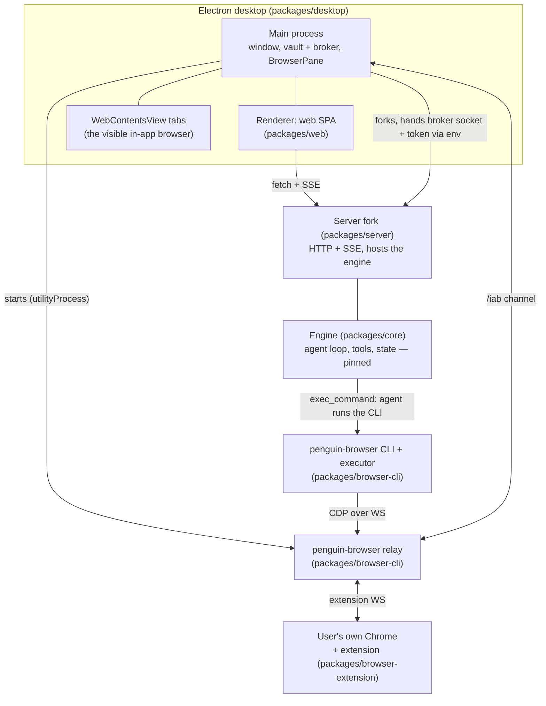

# travel-agent architecture, as built

travel-agent is an open-source consumer travel application. Its core interaction is one exchange: a
user says one sentence; the agent searches, reduces the options to a few representatives with
reasons, waits for a click that is also authorization, fills the form, and stops on the payment
page. This document maps the processes and packages that carry that interaction, and where the
depth lives for each part. It is a living reference — update it in the same change that makes it
wrong.

The product's first-class object is the **Trip**: a journey that owns a directory on the person's
own disk and gathers that journey's conversations, identity and itinerary. Depth and the
alternatives it beat:
[the decision note](../decisions/implemented/2026-08-26-trip-as-server-entity-owning-a-directory.md).

## Process topology



One Electron app owns everything the person sees: the chat UI is the `packages/web` SPA in the
renderer, the in-app browser is a set of `WebContentsView`s beside it, and the vault lives in the
main process. The main process forks the server (`src/server-process.ts`) and starts the relay
(`src/browser-relay.ts`) so a packaged install needs no second terminal. `pnpm dev` runs the same
server and web app without the shell.

## The agent's browser chain

The engine gains no browser tools. The agent drives the browser the same way it runs any command:
the `penguin-browser` skill (`packages/skills/skills/penguin-browser/`) tells it to call the
`penguin-browser` CLI through `exec_command`; the CLI's executor speaks Playwright to the relay's
standard CDP endpoint; the relay forwards to whichever backend the conversation selected —
the in-app `WebContentsView` over the `/iab` channel, or the user's own Chrome through the
extension. Both backends present the relay with an identical interface; the choice is per
conversation, and there is no silent fallback between them.

Depth: [iab-in-app-browser.md](iab-in-app-browser.md) — the relay, target synthesis, ownership and
lifecycle rules, and the Codex comparison.

## The Trip

A Trip is a row in the server's own index that **owns** a directory; it is not a directory. That
distinction carries the whole design, because membership has to change over a conversation's life
— a loose question turns out to be a journey — while a Session's `workspace` cannot: the engine
fixes it at creation, records it in the append-only Trace, and derives memory scope from it.

```
server index
  trips     tripId · projectId · name · destination · when · who · budget · dir
  sessions  + trip_id (nullable)   ← attach / move / detach is one UPDATE

~/Penguin Trips/tokyo-2026-10/
  trip.json      identity, written by the server, read by the agent
  itinerary.md   the plan, written by the model, rendered by the app
  places.json · map.png   optional, written by the model as evidence for a spatial claim
```

The agent works in that directory by absolute path — it is told the path in the visible message
prefix, and the `trip-workspace` skill has it read `trip.json` and `itinerary.md` first. This is
safe because a workspace is a default for relative paths, not a boundary: core's file tools
resolve absolute paths unchanged. A conversation belonging to no Trip is an ordinary state, not a
defect.

Ownership is split the same way everywhere: the server writes what it renders (the row and its
`trip.json` mirror); the model owns the documents. Deleting a Trip detaches its conversations and
leaves the folder alone whenever the journey put anything in it — those files are the person's. A
folder holding nothing but the `trip.json` the server itself wrote is removed with the row, so a
trip that never started leaves no husk behind.

## The payment stop

Search and selection are ordinary agent work. Money is not:

1. The agent raises interaction cards (`server/src/interaction/`), including the complete purchase
   summary the person can review. Confirming that card acknowledges the summary; it does not grant
   the agent authority to spend.
2. The page-level write surface is enumerated, not sampled: `browser-cli`'s
   `executor/write-gate.ts` and `executor/payment-gate.ts` decide what may be clicked, and the
   payment check has no enable flag.
3. The agent stops on the payment page. The person completes the irreversible action in the
   browser; there is no agent-triggered payment executor, one-shot payment capability, or WAL path.

## Boundaries that hold the shape

- **The engine does not know penguin-browser exists.** `packages/core` and `packages/server` have
  no dependency on it; only `packages/desktop` does (`package.json`: `penguin-browser:
  workspace:*`). The join happens in travel-agent's own surfaces: the desktop shell wires the
  relay, and the skill teaches the agent the CLI.
- **The engine baseline is pinned.** `core` and `server` are a hard-fork snapshot of PenguinHarness
  0.2.2; changes there are deliberate decisions (root `AGENTS.md`, Hard Rules).
- **Capability gates fail closed.** `vault.l2l3` and `secret_entry.live` resolve
  from runtime probes in `core/src/state/feature-flags.ts` and stay off until the agent runtime is
  isolated — the open decision D3
  ([agent-runtime-isolation](../decisions/proposed/2026-08-16-agent-runtime-isolation.md)).
- **Ordinary browser outputs redact values filled by main.** Immediately before ARIA, page
  Markdown, clean HTML or a labelled screenshot is produced, the IAB executor pulls that target's
  complete fingerprint registry over the authenticated relay channel. Text is replaced before it
  enters diff caches; screenshot boxes are refreshed in main and painted opaque, or the image is
  refused if any box cannot be verified. This is a guardrail against accidental output, not a
  security boundary: deliberate raw CDP access remains why the D3 isolation gate stays closed.
- **The model judges; code only enforces** where the model is inside the threat model. The payment
  gate is code because the model controls the click surface; offer selection remains model work.

## Data on disk

Installed apps use `~/.penguin/data`; dev entry points default to `~/.penguin/dev-data`. The vault
file, grants, audit chain and traces live under the app's data root; a conversation's downloads
live in that session's scratchpad and are deleted with it.

## Where the depth lives

| Part | Document or code |
| --- | --- |
| In-app browser, relay, ownership | [iab-in-app-browser.md](iab-in-app-browser.md) |
| Decision records and open decisions | [../decisions/](../decisions/README.md) |
| Interaction-card contract | `packages/server/src/api/types.ts`, `server/src/interaction/` |
| Browser handover and payment stop | `packages/browser-cli/src/executor/handover-state.ts`, `payment-gate.ts` |
| Capability gating | `packages/core/src/state/feature-flags.ts`, `server/src/http/routes/capabilities.ts` |
| Where any prose belongs | [../AGENTS.md](../AGENTS.md) |
