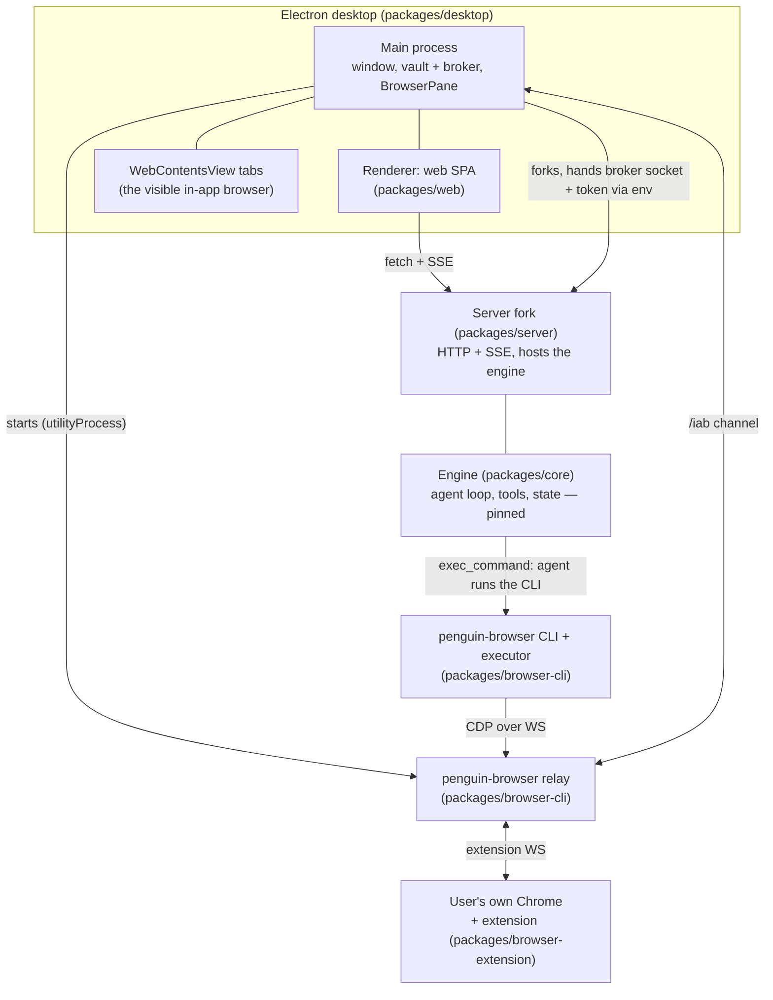

# travel-agent architecture, as built

The product is one interaction: a user says one sentence; the agent searches, reduces the options
to a few representatives with reasons, waits for a click that is also authorization, fills the
form, and stops on the payment page. This document maps the processes and packages that carry that
interaction, and where the depth lives for each part. It is a living reference — update it in the
same change that makes it wrong.

## Process topology

One Electron app owns everything the person sees: the chat UI is the `packages/web` SPA in the
renderer, the in-app browser is a set of `WebContentsView`s beside it, and the vault lives in the
main process. The main process forks the server (`src/server-process.ts`) and starts the relay
(`src/browser-relay.ts`) so a packaged install needs no second terminal. `pnpm dev` runs the same
server and web app without the shell.

## The agent's browser chain

The engine gains no browser tools. The agent drives the browser the same way it runs any command:
the `penguin-browser` skill (`packages/skills/skills/penguin-browser/`) tells it to call the
`penguin-browser` CLI through `exec_command`; the CLI's executor speaks Playwright to the relay's
standard CDP endpoint; the relay forwards to whichever backend the conversation selected —
the in-app `WebContentsView` over the `/iab` channel, or the user's own Chrome through the
extension. Both backends present the relay with an identical interface; the choice is per
conversation, and there is no silent fallback between them.

Depth: [iab-in-app-browser.md](iab-in-app-browser.md) — the relay, target synthesis, ownership and
lifecycle rules, and the Codex comparison.

## The money path

Search and selection are ordinary agent work. Money is not:

1. The agent raises interaction cards (server `src/interaction/`) — the person's click on a card is
   the authorization, carried as a one-shot capability (`packages/transaction`, `capability.ts`).
2. Every irreversible submit goes through `submitBooking` (`packages/transaction`, `booking.ts`) —
   journaled, drift-checked, capability-gated. Both spending surfaces call it: the server's payment
   guard (`server/src/interaction/payment.ts`) and the desktop's payment authority
   (`desktop/src/vault/payment-authority.ts`).
3. The page-level write surface is enumerated, not sampled: `browser-cli`'s
   `executor/write-gate.ts` and `executor/payment-gate.ts` decide what may be clicked, and the
   agent does not press the button that takes the money — it stops on the payment page.

## Boundaries that hold the shape

- **The engine does not know penguin-browser exists.** `packages/core` and `packages/server` have
  no dependency on it; only `packages/desktop` does (`package.json`: `penguin-browser:
  workspace:*`). The join happens in travel-agent's own surfaces: the desktop shell wires the
  relay, and the skill teaches the agent the CLI.
- **The engine baseline is pinned.** `core` and `server` are a hard-fork snapshot of PenguinHarness
  0.2.2; changes there are deliberate decisions (root `AGENTS.md`, Hard Rules).
- **Capability gates fail closed.** `vault.l2l3`, `secret_entry.live` and `payments.execute` resolve
  from runtime probes in `core/src/state/feature-flags.ts` and stay off until the agent runtime is
  isolated — the open decision D3
  ([agent-runtime-isolation](../decisions/proposed/2026-08-16-agent-runtime-isolation.md)).
- **The model judges; code only enforces** where the model is inside the threat model — which is
  why `packages/transaction` exists and a rules-based "travel domain" layer does not.

## Data on disk

Installed apps use `~/.penguin/data`; dev entry points default to `~/.penguin/dev-data`. The vault
file, grants, audit chain and traces live under the app's data root; a conversation's downloads
live in that session's scratchpad and are deleted with it.

## Where the depth lives

| Part | Document or code |
| --- | --- |
| In-app browser, relay, ownership | [iab-in-app-browser.md](iab-in-app-browser.md) |
| Decision records and open decisions | [../decisions/](../decisions/README.md) |
| Transaction semantics | `packages/transaction/src/` (`booking.ts`, `capability.ts`, `journal.ts`) |
| Capability gating | `packages/core/src/state/feature-flags.ts`, `server/src/http/routes/capabilities.ts` |
| Where any prose belongs | [../AGENTS.md](../AGENTS.md) |
