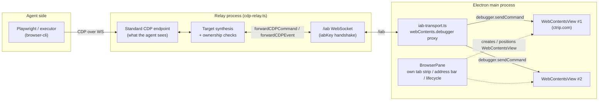
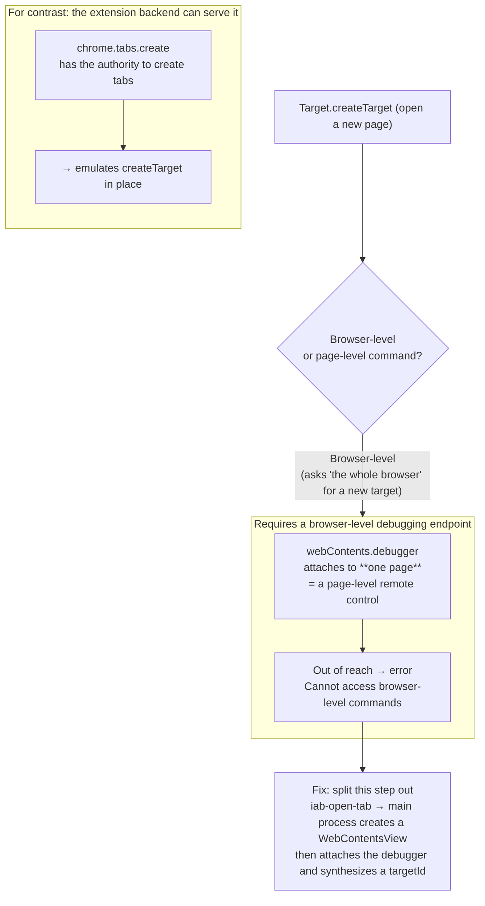
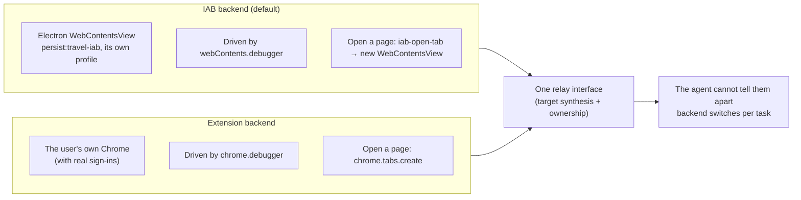
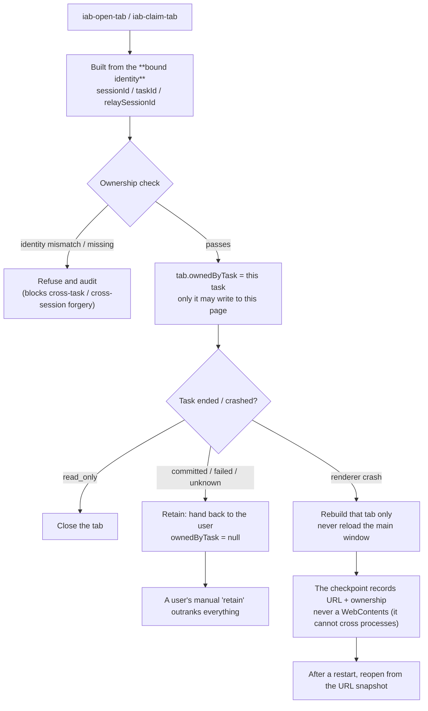

# How the in-app browser (IAB) works

> Mermaid diagrams explaining how the "browser inside the app" actually operates. Open this file in
> VS Code with a Mermaid preview extension, or on GitHub, to see them rendered.
>
> Code:
> `packages/desktop/src/browser-pane.ts`, `iab-transport.ts`,
> `packages/browser-cli/src/relay/cdp-relay.ts`, `src/executor/executor.ts`.

## In one sentence

A **real Chromium web view** (`WebContentsView`) is embedded in the right-hand side of the Electron
main window, and the agent drives it through a CDP relay we build ourselves — over
`webContents.debugger`, deliberately **without** opening the dangerous
`--remote-debugging-port`.

---

## 1. The architecture, across three processes



**The point:** the agent sees nothing but a standard CDP endpoint. The relay wraps each command as
`forwardCDPCommand` and sends it through the `/iab` channel into the main process, which executes it
against **each individual** view through `webContents.debugger`. No
`--remote-debugging-port` is opened; that is where the security boundary sits.

---

## 2. The full sequence of "open Ctrip and search for hotels"

```mermaid
sequenceDiagram
    autonumber
    participant A as Agent/executor
    participant R as Relay
    participant M as Main process
    participant V as WebContentsView

    Note over A,V: 1. Open a new page (CDP cannot do this; a custom command is used)
    A->>R: newPage() → Target.createTarget
    R->>M: iab-open-tab (carries sessionId/taskId)
    M->>V: new WebContentsView
    M->>V: attach webContents.debugger
    M-->>R: return the synthesized targetId
    R-->>A: a new target appears (as if a page had opened)

    Note over A,V: 2. Navigate to Ctrip (an ordinary page-level command, forwarded as-is)
    A->>R: page.goto("ctrip.com") → Page.navigate
    R->>M: forwardCDPCommand
    M->>V: debugger: Page.navigate
    V-->>A: page load finished (reported back as events)

    Note over A,V: 3. Fill destination/dates, then click Search
    A->>R: fill / click → Input/DOM commands
    R->>M: forwardCDPCommand
    M->>V: executed through the debugger
    V-->>A: result plus a snapshot
```

Only "open a new page" bypasses CDP, where the main process builds the view through Electron's own
API. Everything else is an ordinary CDP command forwarded unchanged.

---

## 3. Why `Target.createTarget` needs a special case on Electron



`webContents.debugger` is a **page-level** remote control and cannot open a sibling page. The
extension backend holds `chrome.tabs` page-creation rights, which is precisely why it *can* serve
this command.

---

## 4. The two backends, side by side



Both backends present the relay with an **identical** interface, which is what makes switching
per task possible.

---

## 5. Ownership and lifecycle: the policy you must write yourself once the browser lives in the app



**The point:** a tab carries `ownedByTask`, and only the current agent turn may write to it. Opening
and claiming both derive their identifiers from the bound identity and refuse forgeries. A crash
rebuilds a single tab and leaves the main window alone. The checkpoint stores only URL and
ownership, restore reopens by URL, and a user's "retain" mark overrides every automatic policy.

---

## Responsibilities, by process

| Process | Role |
| --- | --- |
| **Desktop main process** | Holds the `WebContentsView`, draws the browser chrome, executes CDP through `webContents.debugger`, owns ownership and lifecycle |
| **Relay** | Presents a standard CDP endpoint to the agent and forwards through the `/iab` channel into the main process; the target synthesis layer |
| **Agent / executor** | Drives through the relay with Playwright; `tabs.open()` is special-cased onto `iab-open-tab` |

**The decisive trade-off:** `--remote-debugging-port` is not opened — it would expose every target in
the process to any local process with no authentication — and per-target proxying through
`webContents.debugger` is used instead. The security boundary rests on that one choice.

---

## 6. Comparison with Codex

Codex's browser feature is **not** in the open-source `openai/codex` (the Rust CLI). It lives in the
closed-source ChatGPT/Codex Desktop (Electron), plus a Chrome extension and a cloud container
browser. Its internals can therefore only be observed indirectly: through official documentation, and
through real logs and code strings leaked in GitHub issues (sources at the end).

The conclusion: **at the in-app browser layer, we and Codex converged independently on very nearly
the same architecture** — including the decisive choices.

### Point by point

| Dimension | This project (PenguinHarness) | Codex | Same? |
| --- | --- | --- | --- |
| In-app browser container | Electron `WebContentsView` (`persist:travel-iab`, its own profile) | Electron guest `webContents` (sidebar, its own profile) | Yes, nearly identical |
| Agent↔browser transport | `webContents.debugger` per page | `webContents.debugger.sendCommand` per page (20s timeout) | Yes, identical |
| Debugging port opened? | No | No (in-process direct connection; full CDP needs Developer mode plus per-site approval) | Yes, identical |
| Opening a new tab | Custom `iab-open-tab` → main process `new WebContentsView`; no `Target.createTarget` | Evidence points to Electron guest webContents plus `browser-sidebar-manager`; no hard evidence for `Target.createTarget` (strongly inferred against) | Same direction (both avoid `Target.createTarget`) |
| Special-cased commands | Yes | Yes: `Page.reload` goes through Electron's own API; `Input.*` is translated into JS; screenshots use `getLayoutMetrics` + `captureScreenshot` | Yes, same approach |
| Relay / intermediate layer | **Yes** (`cdp-relay` → `/iab` WS → main process) | No public evidence (the IAB path connects in-process, with no separate relay daemon) | **No — the largest difference** |
| Chrome extension backend | Yes (switchable with IAB per task) | Yes (drives the user's real Chrome / existing tabs) | Yes, same role |
| Cloud browser | No | Yes (Work mode, server-side container) | No — Codex has one more |

### Three observations

1. **The architectures converged.** The container (Electron webContents), the transport (per-page
   debugger), refusing to open a debugging port, and special-casing commands — both sides made the
   same four choices independently. That is a strong endorsement of this project's design.

2. **The one real difference is our extra relay layer.** Codex's IAB connects to
   `webContents.debugger` **in-process**; we put `cdp-relay` plus an `/iab` WebSocket in between. The
   reason is a different goal: we must present a standard CDP endpoint to an **external
   browser-cli / executor**, and switch between the **IAB and extension backends behind one
   interface** (see §4). Codex's IAB is a closed loop inside its own Electron app, does not have to
   expose a standard endpoint, and can therefore skip the relay. **The relay is the price of
   "switchable backends plus a standard CDP surface" — not overhead that a purely embedded browser
   could avoid.**

3. **Both sides avoid `Target.createTarget` when opening a tab, and the evidence agrees.** Codex's
   logs show tabs as Electron guest `webContents` managed by `browser-sidebar-manager`
   (`guestWebContentsId`, `guest torn down`), with a debugger attached per guest — the same approach
   as our `iab-open-tab` having the main process create a `WebContentsView`. The root cause is also
   the same: `webContents.debugger` is **page-level** and cannot open a sibling page, so the main
   process has to build it (see §3). Whether Codex named a dedicated command like `iab-open-tab` is
   not publicly documented.

### Honest boundaries

- **High confidence (official docs, repository, or log evidence):** Codex uses
  `webContents.debugger`, opens no port, special-cases commands, offers three browser surfaces
  (IAB / extension / cloud), and gates full CDP behind Developer mode.
- **No public information — do not treat as known:** Codex's exact tab-opening mechanism, whether it
  uses `Target.createTarget`, whether it has a relay (evidence leans towards "no"), and the internals
  of the cloud browser.

### Sources

- OpenAI Codex official documentation (three browser surfaces / Developer mode / per-site approval /
  `browser_use_full_cdp_access`):
  <https://learn.chatgpt.com/docs/browser?surface=app>
- `webContents.debugger.sendCommand` with a 20s timeout; `Page.reload` → Electron API; `Input.*` → JS;
  `captureScreenshot` / `getLayoutMetrics`: openai/codex Issue #21560
  <https://github.com/openai/codex/issues/21560>
- `IAB_LIFECYCLE` debugger register/unregister, `browser-session-registry` /
  `browser-sidebar-manager`, guest `webContents` lifecycle: openai/codex Issue #23267
  <https://github.com/openai/codex/issues/23267>
- No browser-automation dependency in the CLI and no IAB source in the repository: verified item by
  item against `openai/codex`'s `Cargo.toml`, a recursive tree, and `gh search code`, all empty
  (`BrowserUseRequirements.ts` contains only a trivial type).
