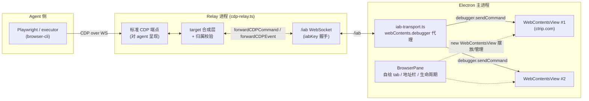
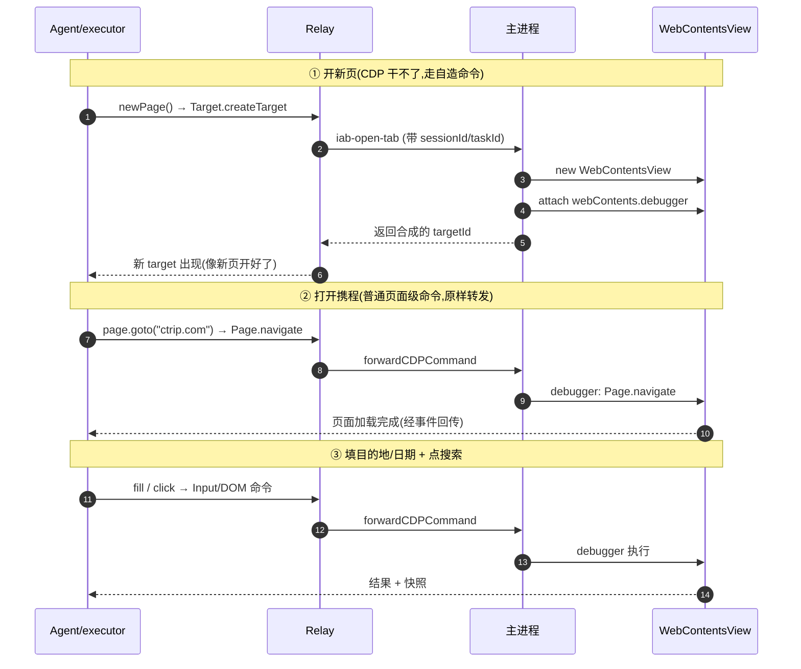
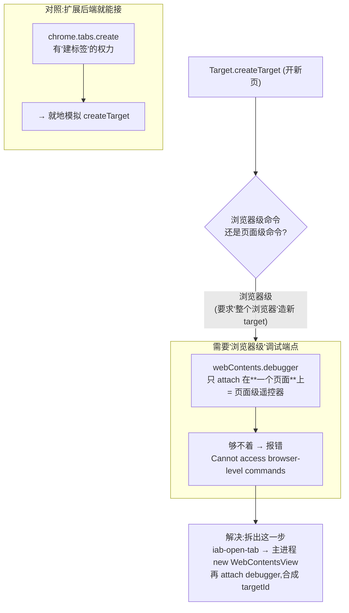
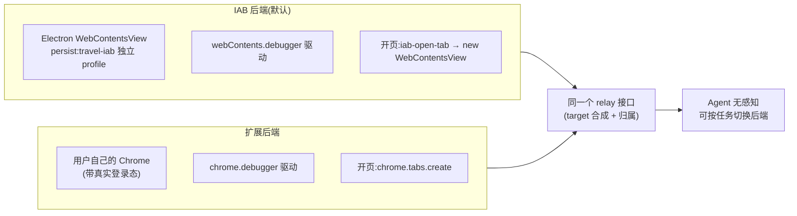
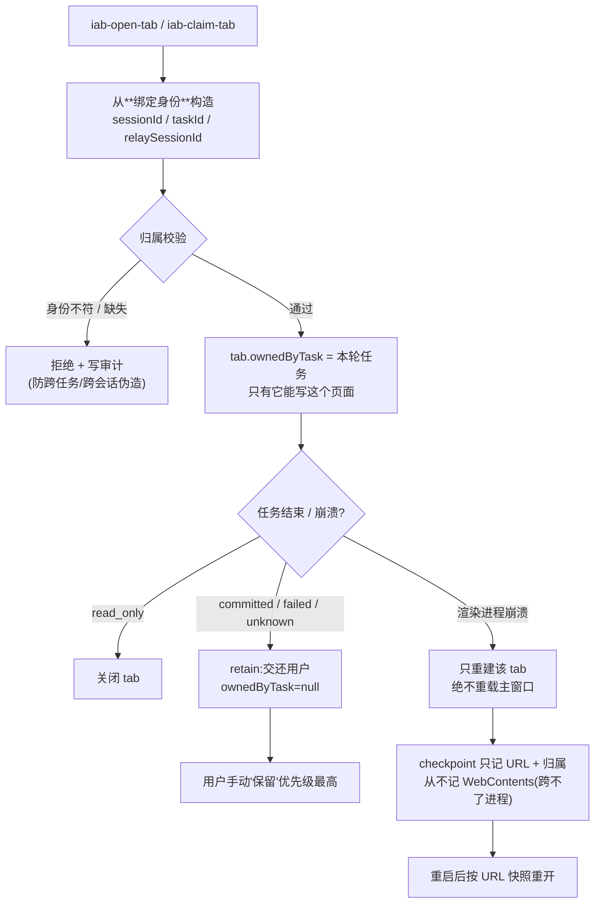

# 内嵌浏览器(IAB)实现原理

> 用 Mermaid 图讲清楚"应用内浏览器"是怎么工作的。用 VS Code(Mermaid 预览插件)或
> 在 GitHub 上打开本文件即可看到渲染后的图。
>
> 参考:`design/002-codex-style-single-window-iab.md`;代码:`packages/desktop/src/browser-pane.ts`、
> `iab-transport.ts`、`packages/browser-cli/src/cdp-relay.ts`、`executor.ts`。

## 一句话

在 Electron 主窗口右侧嵌一块**真实的 Chromium 网页视图**(`WebContentsView`),让 agent 通过一条
自建的 CDP 中继通道去驱动它——用的是 `webContents.debugger`,而**不开**危险的
`--remote-debugging-port`。

---

## 1. 整体架构(三层进程)

**要点**:agent 眼里只有一个"标准 CDP 端点";relay 把命令包成 `forwardCDPCommand` 经 `/iab` 通道送进
主进程;主进程用 `webContents.debugger` 对**每一个** view 单独执行。不开 `--remote-debugging-port`,
安全边界就在这。

---

## 2. "打开携程搜酒店"整条时序

只有"开新页"这一步不走 CDP,由主进程用 Electron API 造 view;其余全是普通 CDP 命令原样转发。

---

## 3. 为什么 `Target.createTarget` 在 Electron 上要特判

`webContents.debugger` 是**页面级**遥控器,开不出兄弟页;扩展后端有 `chrome.tabs` 建页权,所以它反而
能接这条命令。

---

## 4. 两个后端对照

两个后端对 relay 呈现**一模一样**的接口,所以可以按任务切换。

---

## 5. 归属与生命周期(把浏览器搬进 app 后必须自己写的策略)

**要点**:tab 带 `ownedByTask`,只有当前这轮 agent 能写;开页/认领都从绑定身份构造标识、拒绝伪造;
崩溃只重建单个 tab,不动主窗口;checkpoint 只存 URL 与归属,重启按 URL 恢复,用户"保留"标记压倒一切
自动策略。

---

## 三层职责小结

| 进程 | 角色 |
| --- | --- |
| **桌面主进程** | 持有 `WebContentsView`、自绘 chrome、`webContents.debugger` 执行 CDP、管归属/生命周期 |
| **Relay** | 对 agent 呈现标准 CDP 端点,`/iab` 通道转发到主进程;target 合成层 |
| **Agent / executor** | 用 Playwright 经 relay 驱动;`tabs.open()` 特判走 `iab-open-tab` |

**关键取舍**:不开 `--remote-debugging-port`(那会把进程里所有 target 零认证暴露给任意本地进程),
改用 `webContents.debugger` 逐 target 代理——安全边界就在这一条上。
